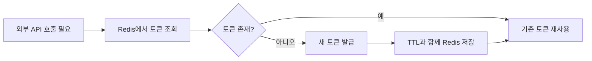
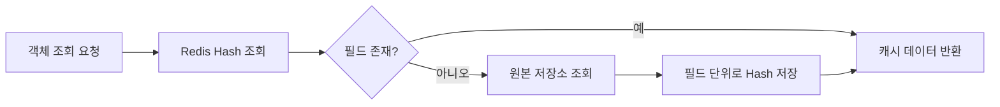
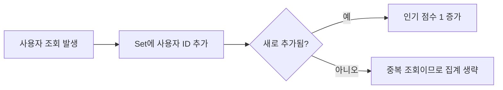

# 레디스의 자료 구조

## String

* 최대 512MB 문자열 데이터 저장 가능
* 이진 데이터를 포함하는 모든 종류의 문자열이 binary-safe하게 처리되기 때문에 JPEG 이미지와 같은 바이트 값, HTTP 응답값 등의 다양한 데이터를 저장하는 것도 가능
* 키와 실제 저장되는 아이템이 1:1로 연결되는 유일한 자료 구조
* 다른 자료구조에서는 하나의 키에 여러 개의 아이템이 저장됨

```bash
> SET hello world
OK

> GET hello
"world"
```

이때 해당 키에 다른 값이 있었다면 대체됨, 다른 구조라도 동일하게 동작한다.

```bash
> SET hello newval NX
(nil)
```

XX 옵션을 사용하면 반대로 키가 이미 있을 때만 새로운 값으로 덮어쓰며 새로운 키를 생성하지 않도록 동작한다.

```bash
> SET counter 10
OK

> INCR counter
(integer) 11

> INCRBY counter 5
(integer) 16

> DECR counter
(integer) 15

> DECRBY counter 3
(integer) 12
```

#### 🤔 **원자적이란?**

같은 키에 접근하는 클라이언트가 race condition을 발생시킬 일이 없음을 의미한다.

#### 🤔 **어떻게 가능하지?**

레디스는 싱글 스레드 기반으로 동작하기 때문에 하나의 명령어가 실행되는 동안 다른 명령어가 끼어들 수 없다. 따라서 INCR 같은 연산이 안전하게 수행된다.

`MSET`, `MGET` 커맨드를 이용하면 한 번에 여러 키를 조작할 수 있다.

```bash
> MSET a 1 b 2 c 3
OK

> MGET a b c
1) "1"
2) "2"
3) "3"
```

성능이 중요한 대규모 시스템에서는 벌크 처리를 통해 응답 속도를 향상시킬 수 있다.

#### 예시

실무에서는 String을 "키 하나에 값 하나"로 저장하는 단순 캐시에 가장 많이 활용할 수 있다.

예를 들면 아래 같은 데이터가 잘 어울린다.

* 외부 API 인증 토큰 캐시
* 검색 동기화의 마지막 처리 시점 저장
* 배치 작업의 마지막 실행 위치 저장
* 지역 정보 같은 짧은 TTL 캐시

```bash
> SET api-token:external "token-value" EX 259200
OK

> GET api-token:external
"token-value"

> SET sync:last-run "2026-04-23T10:30:00"
OK

> GET sync:last-run
"2026-04-23T10:30:00"
```

```text
Key                     Value
api-token:external      "token-value"
sync:last-run           "2026-04-23T10:30:00"
job:last-item-id        "182341"
region:11000            "{...json...}"
```



#### 🤖 AI 첨언

이 경우는 `String`이 꽤 적절하다. 토큰, 마지막 처리 시점, 단일 상태값처럼 "키 하나에 값 하나" 구조가 자연스럽기 때문이다.

다만 하나의 키 아래에 속성이 여러 개 붙기 시작하면 `Hash`가 더 적절할 수 있다. 예를 들어 토큰 값, 발급 시각, 만료 시각, 발급 주체를 함께 저장해야 하면 `String` 하나보다 `Hash`가 읽기 쉬울 수 있다.

## List

* 순서를 가지는 문자열의 목록
* 최대 42억여 개의 아이템을 저장할 수 있다.
* 인덱스를 이용해 직접 접근도 가능하며, 일반적으로 스택과 큐로서 사용된다.

`LPUSH`, `RPUSH`

```bash
> LPUSH mylist a
(integer) 1

> RPUSH mylist b
(integer) 2

> RPUSH mylist c
(integer) 3
```

`LRANGE`, `LPOP`, `LTRIM`, `LPUSH`, `LINSERT`

```bash
> LRANGE mylist 0 -1
1) "a"
2) "b"
3) "c"

> LPOP mylist
"a"

> LINSERT mylist BEFORE b x
(integer) 3

> LTRIM mylist 0 1
OK
```

주기적으로 로그 데이터를 삭제해 저장 공간을 확보하고 싶을 때 `LPUSH`, `LTRIM` 커맨드를 같이 사용할 수 있다.

```bash
> LPUSH logs "log1"
> LPUSH logs "log2"
> LTRIM logs 0 1
```

일단 쌓은 뒤 배치 처리로 삭제하는 것보다 훨씬 효율적이다. 매번 큐의 마지막 데이터만 삭제되기 때문이다.

`LSET`, `LINDEX`

```bash
> LINDEX mylist 0
"a"

> LSET mylist 0 "z"
OK
```

#### 예시

현재 프로젝트 기준으로는 List를 핵심 자료구조로 적극 활용하는 사례는 많지 않지만, 아래 같은 경우에 잘 맞는다.

* 최근 이벤트 N개 유지
* 간단한 작업 큐
* 최근 로그 샘플 보관

```bash
> LPUSH recent:logs "event1"
(integer) 1

> LPUSH recent:logs "event2"
(integer) 2

> LTRIM recent:logs 0 1
OK

> LRANGE recent:logs 0 -1
1) "event2"
2) "event1"
```

```text
recent:logs
┌─────────┐
│ event2  │
│ event1  │
└─────────┘
```

#### 🤖 AI 첨언

`List`는 "최근 N개 유지", "앞/뒤로 넣고 빼기", "단순 큐" 같은 경우에는 적절하다.

하지만 작업 처리 이력 추적, 소비자 그룹, 재처리, ack 같은 기능이 필요하면 `List`보다 `Stream`이 더 적절할 수 있다.

또한 단순 순서가 아니라 우선순위나 요청 시각 기준 정렬이 중요하다면 `List`보다 `Sorted Set`이 더 잘 맞는다.

## Hash

* 필드=값 쌍을 가진 아이템의 집합이다.
* 하나의 hash 자료 구조 내에서 아이템은 필드-값 쌍으로 저장된다. 필드는 하나의 hash 내에서 유일하며, 필드와 값 모두 문자열 데이터로 저장된다.
* 객체로 표현하기 적절한 자료 구조이기 때문에 관계형 데이터베이스의 테이블 데이터로 변환하는 것도 간편하다.
* 컬럼이 고정된 RDB 테이블과 달리 각 아이템마다 다른 필드를 가질 수 있다.

`HSET`, `HMGET`, `HGETALL`

```bash
> HSET user:1 name "kim" age "25"
(integer) 2

> HMGET user:1 name age
1) "kim"
2) "25"

> HGETALL user:1
1) "name"
2) "kim"
3) "age"
4) "25"
```

자바 예시

```java
class User {
    String name;
    int age;
}

// Redis 저장 형태
// key: user:1
// field-value:
// name -> kim
// age -> 25
```

#### 예시

Hash는 하나의 객체를 여러 속성으로 나눠 저장할 때 적합하다.

예를 들면 아래 같은 데이터에 잘 어울린다.

* 가상 연락처 매핑 정보
* 엔티티별 랭킹/집계 정보
* 사용자 프로필 캐시

```bash
> HSET contact:map:1001 virtualNumber "050-1234-5678" realNumber "010-1111-2222" userId "1001" orgId "200"
(integer) 4

> HGETALL contact:map:1001
1) "virtualNumber"
2) "050-1234-5678"
3) "realNumber"
4) "010-1111-2222"
5) "userId"
6) "1001"
7) "orgId"
8) "200"
```

```text
Key: contact:map:1001

┌───────────────┬──────────────────┐
│ virtualNumber │ 050-1234-5678    │
│ realNumber    │ 010-1111-2222    │
│ userId        │ 1001             │
│ orgId         │ 200              │
└───────────────┴──────────────────┘
```



#### 🤖 AI 첨언

이 경우는 `Hash`가 비교적 적절하다. 하나의 엔티티를 여러 필드로 나눠 저장하기 때문이다.

반대로 필드가 거의 없고 항상 통째로 읽고 쓰는 구조라면 `String`에 JSON 하나로 넣는 편이 더 단순할 수도 있다. 또 정렬이나 순위 계산이 필요하면 `Hash`만으로는 부족하고 `Sorted Set` 같은 자료구조를 함께 써야 한다.

## SET

* 정렬되지 않은 문자열의 모음
* 교집합, 합집합, 차집합 등의 집합 연산과 관련한 커맨드를 제공하기 때문에 객체 간의 관계를 계산하거나 유일한 원소를 구해야 할 경우에 사용한다.

`SADD`, `SREM`, `SMEMBERS`, `SPOP`

```bash
> SADD myset a b c
(integer) 3

> SMEMBERS myset
1) "a"
2) "b"
3) "c"

> SREM myset b
(integer) 1

> SPOP myset
"a"
```

`SUNION`, `SINTER`, `SDIFF`

```bash
> SADD set1 a b c
> SADD set2 b c d

> SINTER set1 set2
1) "b"
2) "c"

> SUNION set1 set2
1) "a"
2) "b"
3) "c"
4) "d"

> SDIFF set1 set2
1) "a"
```

#### 예시

Set은 "중복 없는 원소 집합"이라는 특징을 가장 직관적으로 보여주는 자료구조다.

예를 들어 같은 사용자가 같은 날짜에 같은 대상을 여러 번 조회하더라도 1번만 집계하고 싶을 때 사용할 수 있다.

```bash
> SADD viewers:20260423:topic:A 101
(integer) 1

> SADD viewers:20260423:topic:A 101
(integer) 0

> SADD viewers:20260423:topic:A 205
(integer) 1

> SMEMBERS viewers:20260423:topic:A
1) "101"
2) "205"
```

```text
Key: viewers:20260423:topic:A

┌───────┐
│ 101   │
│ 205   │
└───────┘
```



#### 🤖 AI 첨언

이 경우는 `Set`이 적절하다. 핵심 요구사항이 "중복 제거"이기 때문이다.

다만 "대략적인 유니크 수만 알면 되고 실제 사용자 목록은 필요 없다"면 `Set`보다 `HyperLogLog`가 메모리 측면에서 더 유리할 수 있다.

또 "중복 제거 + 점수 집계"까지 같이 필요하면 실제 구현에서는 `Set`과 `Sorted Set`을 함께 쓰는 방식이 자연스럽다.

## SORTED SET

* 스코어 값에 따라 정렬되는 고유한 문자열의 집합이다.
* 모든 아이템은 스코어-값 쌍을 가지며, 저장될 때부터 스코어 값으로 정렬돼 저장된다.
* 같은 스코어를 가진 아이템은 데이터의 사전 순으로 정렬돼 저장된다.
* 데이터는 중복 없이 유일하게 저장되므로 set과 유사하며, 스코어라는 데이터에 연결돼 있어 hash와 유사하기도 하다.
* 또한 스코어 순으로 정렬돼 있어 list처럼 인덱스를 이용해 각 아이템에 접근할 수 있다.

list vs sorted set

모두 순서를 갖는 자료 구조라 인덱스를 통해 접근할 때 list가 더 빠를 것 같지만, sorted set이 더 빠르다.

list에서는 O(n)이지만, sorted set에서는 O(log n)으로 처리되기 때문이다.

`ZADD`으로 저장

```bash
> ZADD ranking 100 user1
(integer) 1

> ZADD ranking 200 user2
(integer) 1

> ZADD ranking 150 user3
(integer) 1
```

→ 만약 이미 있으면 스코어만 업데이트되며 업데이트된 스코어에 의해 아이템이 재정렬된다.

존재하지 않으면 새로 생성되며, 이미 존재하지만 sorted set이 아니면 오류를 반환한다.

스코어는 배정밀도 부동소수점 숫자를 문자열로 표현한 값이어야 한다.

→ 예를 들어 "100", "99.5" 같은 형태이다.

`ZADD` 커맨드는 다양한 옵션을 지원한다.

`XX`, `NX`, `LT`, `GT`

```bash
> ZADD ranking NX 300 user4
(integer) 1

> ZADD ranking XX 500 user1
(integer) 0
```

`ZRANGE` 커맨드 - 조회 시 `start`, `stop`이라는 범위를 항상 입력해야 한다.

```bash
> ZRANGE ranking 0 -1
1) "user1"
2) "user3"
3) "user2"
4) "user4"
```

`WITHSCORES`

```bash
> ZRANGE ranking 0 -1 WITHSCORES
1) "user1"
2) "500"
3) "user3"
4) "150"
5) "user2"
6) "200"
7) "user4"
8) "300"
```

`BYSCORE`

```bash
> ZRANGEBYSCORE ranking 100 300
1) "user3"
2) "user2"
3) "user4"
```

사전 순으로 데이터 조회도 가능하다.

같은 스코어면 사전순으로 저장된다고 했는데 `BYLEX`로 조회 가능하다.

```bash
> ZRANGEBYLEX ranking - +
```

#### 예시

Sorted Set은 점수 기반 랭킹이나 순서 관리에 특히 잘 맞는다.

실무에서 설명하기 좋은 대표 예시는 아래 두 가지다.

1. 인기 항목 랭킹 집계
2. 작업 요청 대기 순서 관리

```bash
> ZINCRBY rank:topic:20260423 1 itemA
"1"

> ZINCRBY rank:topic:20260423 1 itemB
"1"

> ZINCRBY rank:topic:20260423 1 itemA
"2"

> ZREVRANGE rank:topic:20260423 0 4 WITHSCORES
1) "itemA"
2) "2"
3) "itemB"
4) "1"
```

```text
Key: rank:topic:20260423

        Member      Score
     ┌───────────┬─────────┐
     │ itemA     │ 100     │
     │ itemD     │  98     │
     │ itemB     │  34     │
     │ itemC     │   3     │
     └───────────┴─────────┘
```

대기열도 score에 timestamp를 넣으면 비슷하게 관리할 수 있다.

```bash
> ZADD queue:job 1713855600000 worker101
(integer) 1

> ZADD queue:job 1713855660000 worker205
(integer) 1

> ZADD queue:job 1713855720000 worker309
(integer) 1

> ZRANGE queue:job 0 -1 WITHSCORES
1) "worker101"
2) "1713855600000"
3) "worker205"
4) "1713855660000"
5) "worker309"
6) "1713855720000"
```


#### 🤖 AI 첨언

랭킹, 점수 누적, 대기 순서 계산 같은 요구사항에는 `Sorted Set`이 매우 적절하다.

다만 단순히 최근 데이터 몇 개만 보관하면 되는 경우라면 `Sorted Set`까지는 과하고 `List`가 더 단순할 수 있다.

또 메시지 소비, 재시도, 소비자 그룹 같은 브로커 기능이 필요하면 `Sorted Set`보다는 `Stream`이나 별도 메시지 큐가 더 적절할 수 있다.

## 비트맵

* string 자료구조에 비트 연산을 수행할 수 있도록 확장한 형태이다.
* 가장 큰 장점은 저장 공간을 획기적으로 줄일 수 있다는 것이다.
* 각각의 유저가 정수 형태의 ID로 구분되고, 전체 유저가 40억이 넘는다고 해도 각 유저에 대한 y/n 데이터는 512MB 안에 충분히 저장할 수 있다.

#### 🤔 **대체 어디에 써먹는 자료구조지?**

대표적으로 출석 체크, 로그인 여부, 특정 이벤트 참여 여부 등을 저장할 때 사용한다.

```bash
> SETBIT user:visit 100 1
(integer) 0

> GETBIT user:visit 100
(integer) 1
```

#### 예시

현재 프로젝트에서 직접 사용한 사례는 없었지만, 비트맵은 y/n 형태의 상태를 매우 적은 메모리로 저장할 때 유용하다.

예를 들면 아래 같은 경우에 적합하다.

* 오늘 출석 여부
* 특정 기능 노출 여부
* 이벤트 참여 여부

```bash
> SETBIT attendance:20260423 101 1
(integer) 0

> GETBIT attendance:20260423 101
(integer) 1

> BITCOUNT attendance:20260423
(integer) 1
```

```text
attendance:20260423
index(userId) -> bit
101 -> 1
102 -> 0
103 -> 1
```

#### 🤖 AI 첨언

비트맵은 메모리 효율은 뛰어나지만, 사람이 직접 읽기 어렵고 userId 같은 정수 인덱스에 강하게 의존한다.

그래서 대상 수가 많지 않거나 개별 사용자 목록 조회가 더 중요하면 `Set`이 더 다루기 쉬울 수 있다.

## HyperLogLog

* 집합의 원소 개수인 카디널리티를 추정할 수 있는 자료 구조이다.
* 대량 데이터에서 중복되지 않는 고유한 값을 집계할 때 유용하게 사용할 수 있는 구조이다.
* set과 같은 데이터 구조에서는 중복을 피하기 위해 저장된 데이터를 모두 기억하고 있으며, 따라서 저장되는 데이터가 많아질수록 그만큼 많은 메모리를 사용한다.
* hyperloglog는 입력되는 데이터 그 자체를 저장하지 않고 자체적인 방법으로 변경해 처리한다.
* 따라서 저장되는 데이터 개수에 구애받지 않고 계속 일정한 메모리를 유지할 수 있으며, 중복되지 않는 유일한 원소의 개수를 계산할 수 있다.
* 하나의 hyperloglog 자료 구조는 최대 12KB의 크기를 가지며 카디널리티 추정의 오차는 0.81%로 비교적 정확한 편이다.

`PFADD`, `PFCOUNT`

```bash
> PFADD visitors user1 user2 user3
(integer) 1

> PFCOUNT visitors
(integer) 3
```

#### 예시

현재 프로젝트에서 직접 사용한 사례는 없었지만, HyperLogLog는 "정확한 목록"보다 "대략 몇 명인지"가 중요한 경우에 적합하다.

예를 들면 아래 같은 경우에 활용할 수 있다.

* 일간 순방문자 수 추정
* 중복 제거된 검색 사용자 수 추정
* 대규모 이벤트 참여자 수 추정

```bash
> PFADD uv:20260423 user1 user2 user3
(integer) 1

> PFCOUNT uv:20260423
(integer) 3
```

```text
정확한 사용자 목록은 저장하지 않음
-> 대략적인 유니크 수만 계산
```

#### 🤖 AI 첨언

`HyperLogLog`는 유니크 수 추정에는 적절하지만, 실제 사용자 목록이 필요한 경우에는 맞지 않는다.

즉 "누가 들어왔는지"가 중요하면 `Set`, "몇 명쯤 들어왔는지"만 중요하면 `HyperLogLog`가 더 적절하다고 볼 수 있다.

## Geospatial

* 경도, 위도 데이터 쌍의 집합으로 지리 데이터를 저장한다.
* 내부적으로 데이터는 sorted set으로 저장되며, 하나의 자료 구조 안에 키는 중복되어 저장되지 않는다.

`GEOADD <key> <longitude> <latitude> <member>` 순서로 저장된다.

```bash
> GEOADD locations 127.0 37.5 seoul
(integer) 1
```

`XX`, `NX` 옵션도 사용 가능하다.

```bash
> GEOADD locations NX 128.0 35.0 busan
(integer) 1
```

`GEOPOS` 조회

```bash
> GEOPOS locations seoul
1) 1) "127.0"
   2) "37.5"
```

`GEODIST` 조회

```bash
> GEODIST locations seoul busan km
```

`GEOSEARCH`, `BYRADIUS`, `BYBOX`

```bash
> GEOSEARCH locations FROMLONLAT 127.0 37.5 BYRADIUS 10 km
```

#### 예시

현재 프로젝트는 지도 관련 기능이 있더라도 Redis GEO 명령을 직접 사용하는 구조는 아니지만, 위치 기반 검색을 Redis로 처리한다면 아래처럼 활용할 수 있다.

```bash
> GEOADD places 127.0276 37.4979 placeA
(integer) 1

> GEOADD places 127.0340 37.4912 placeB
(integer) 1

> GEODIST places placeA placeB km

> GEOSEARCH places FROMLONLAT 127.03 37.49 BYRADIUS 3 km
```

```text
Key: places

Member     Longitude    Latitude
placeA     127.0276     37.4979
placeB     127.0340     37.4912
```

#### 🤖 AI 첨언

`Geospatial`은 반경 검색이나 거리 계산이 자주 필요한 경우에는 적절하다.

하지만 복잡한 조건 검색, 다양한 필터 조합, 정교한 지리 연산이 많다면 Redis GEO만으로는 한계가 있어서 DB나 검색엔진의 공간 검색 기능이 더 적절할 수도 있다.

## Stream

* 레디스를 메시지 브로커로서 사용할 수 있게 하는 자료구조이다.
* 카프카에서 영향을 받아 만들어졌으며, 소비자 그룹 개념을 도입해 데이터를 분산 처리할 수 있는 시스템이다.
* 데이터를 계속해서 추가하는 방식(append-only)으로 저장하므로, 실시간 이벤트 혹은 로그성 데이터의 저장을 위해 사용할 수 있다.

```bash
> XADD mystream * name "kim" age "25"
"1650000000000-0"
```

```bash
> XRANGE mystream - +
```

```bash
> XGROUP CREATE mystream mygroup 0
OK

> XREADGROUP GROUP mygroup consumer1 COUNT 1 STREAMS mystream >
```

#### 예시

현재 프로젝트에서 Redis Stream을 메시지 브로커로 직접 사용한 사례는 없지만, 아래 같은 경우에 설명용 예시로 적기 좋다.

* 알림 이벤트 적재
* 비동기 후처리 작업 큐
* 로그성 이벤트 수집

```bash
> XADD event:notification * userId 101 type VIEW target itemA
"1713855600000-0"

> XRANGE event:notification - +
1) 1) "1713855600000-0"
   2) 1) "userId"
      2) "101"
      3) "type"
      4) "VIEW"
      5) "target"
      6) "itemA"
```

```text
event:notification
┌─────────────────────┬─────────────────────────────┐
│ 1713855600000-0     │ userId=101, type=VIEW ...  │
└─────────────────────┴─────────────────────────────┘
```

#### 첨언

`Stream`은 이벤트 적재, 소비자 그룹, 순차 처리 같은 요구사항에는 적절하다.

하지만 단순히 최근 로그 몇 개만 저장하면 되는 수준이라면 `List`가 더 단순할 수 있다.

반대로 대규모 서비스에서 강한 내구성, 운영 기능, 복잡한 리트라이가 중요하면 Redis Stream보다 Kafka 같은 전용 메시지 시스템이 더 적절할 수도 있다.
