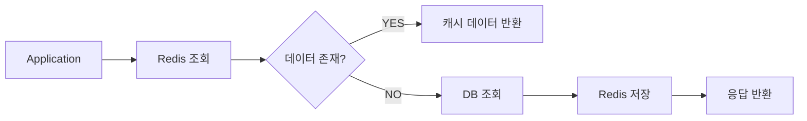
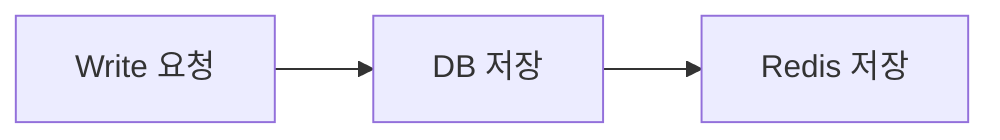
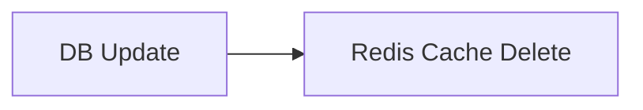
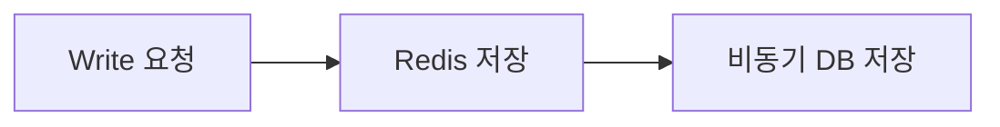
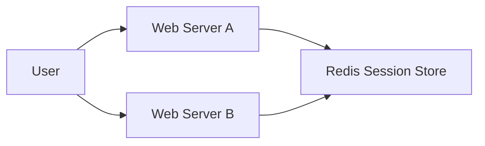

# 레디스를 캐시로 사용하기

## 캐시란?

캐시(Cache)는 원본 데이터 저장소보다 더 빠르게 접근할 수 있는 임시 데이터 저장소를 의미한다.

일반적으로 애플리케이션과 데이터베이스 사이에 위치하며, 자주 조회되는 데이터를 미리 저장해두고 빠르게 응답하는 역할을 한다.

```text
Client
   ↓
Application
   ↓
Cache(Redis)
   ↓
Database
```

캐시에 데이터가 존재하면 데이터베이스까지 접근하지 않기 때문에 응답 속도를 크게 개선할 수 있다.

---

## 캐시를 사용하는 이유

캐시의 핵심 목적은 응답 속도 개선이다.

하지만 실제 운영 환경에서는 단순히 "빠르게 조회"하는 수준을 넘어서 전체 시스템 부하를 줄이기 위한 목적이 더 크다.

캐시를 사용하면 아래와 같은 장점이 있다.

- 데이터베이스 부하 감소
- 응답 속도 개선
- 외부 API 호출 감소
- 대규모 트래픽 대응 가능
- 비용 절감

특히 아래와 같은 데이터는 캐시 적용 효과가 크다.

- 자주 조회되는 데이터
- 계산 비용이 큰 데이터
- 조회 시간이 오래 걸리는 데이터
- 자주 변경되지 않는 데이터

예시

- 인기 게시글
- 랭킹 데이터
- 상품 정보
- 사용자 프로필
- 지역 코드
- 외부 API 응답값

---

## Cache Hit / Cache Miss

### Cache Hit

캐시에 데이터가 존재하는 경우

```text
Redis 조회 성공
↓
즉시 응답
```

데이터베이스 접근 없이 빠르게 응답 가능하다.

---

### Cache Miss

캐시에 데이터가 존재하지 않는 경우

```text
Redis 조회 실패
↓
DB 조회
↓
Redis 저장
↓
응답 반환
```

캐시에 데이터가 없기 때문에 데이터베이스 접근이 발생한다.

---

#### 🤔 모든 데이터를 캐싱하면 안될까?

안된다.

메모리는 디스크보다 훨씬 비싸고 용량이 제한적이다.

따라서 아래 조건을 만족하는 데이터 위주로 캐싱하는 것이 중요하다.

- 조회 빈도가 높은 데이터
- 변경이 자주 발생하지 않는 데이터
- 계산 비용이 큰 데이터
- 응답 속도가 중요한 데이터

---

# 캐시로서의 레디스

Redis는 대표적인 인메모리 기반 캐시 시스템이다.

모든 데이터를 메모리에 저장하기 때문에 매우 빠른 속도로 읽고 쓸 수 있다.

---

## 레디스를 캐시로 사용하는 이유

### 1. 사용이 단순하다

Redis는 기본적으로 key-value 구조이다.

```bash
> SET user:1 "kim"

> GET user:1
"kim"
```

저장과 조회 방식이 단순하기 때문에 사용하기 쉽다.

---

### 2. 인메모리 데이터 저장소

Redis는 데이터를 메모리에 저장한다.

따라서 디스크 기반 데이터베이스보다 훨씬 빠른 속도로 데이터를 처리할 수 있다.

```text
RDBMS -> Disk 접근
Redis -> Memory 접근
```

평균 읽기/쓰기 속도가 1ms 미만 수준이며 초당 수백만 건의 요청도 처리 가능하다.

---

### 3. 다양한 자료구조 지원

Redis는 단순 String 뿐 아니라 다양한 자료구조를 제공한다.

- String
- Hash
- List
- Set
- Sorted Set
- Stream

따라서 애플리케이션 자료구조를 별도 변환 없이 저장하기 쉽다.

예시

- 랭킹 → Sorted Set
- 세션 → Hash
- 토큰 → String
- 큐 → List

---

### 4. 고가용성 지원

Redis는 Sentinel, Cluster 기능을 제공한다.

- 자동 장애 감지
- Failover
- 복제
- 샤딩

등을 지원하기 때문에 운영 환경에서도 안정적으로 사용할 수 있다.

---

### 5. 수평 확장이 쉽다

Redis Cluster를 사용하면 데이터를 여러 노드에 분산 저장할 수 있다.

즉 Scale-Out 구조를 쉽게 구성할 수 있다.

---

## Twitter 사례

Twitter에서는 Timeline 기능 구현에 Redis를 적극 활용했다.

Timeline은 사용자가 Follow하는 계정들의 최근 트윗을 보여주는 기능이다.

2012년 당시 Twitter는 초당 수십만 건 이상의 Timeline 요청을 처리해야 했다.

이 요청을 모두 데이터베이스에서 직접 처리하면 Query가 매우 복잡해지고 성능이 급격히 저하되었다.

Twitter는 이를 해결하기 위해 Redis에 사용자의 Timeline 정보를 캐싱했다.

```text
사용자 요청
↓
Redis Timeline 조회
↓
Tweet ID 목록 반환
↓
DB Query 단순화
```

또한 모든 사용자의 Timeline을 계속 캐싱하면 메모리가 부족해질 수 있기 때문에,

로그인하지 않은 지 오래된 사용자의 Timeline은 Redis에서 제거했다.

---

# 캐싱 전략

Redis를 캐시로 사용할 때는 데이터를 어떤 방식으로 읽고 저장할지 전략을 선택해야 한다.

대표적인 전략은 아래와 같다.

- Look Aside
- Write Through
- Cache Invalidation
- Write Behind

---

# 읽기 전략

## Look Aside(Cache Aside)

가장 일반적으로 사용하는 캐싱 전략이다.

애플리케이션이 먼저 Redis를 조회하고, 데이터가 없으면 DB를 조회한 뒤 Redis에 저장한다.



---

### Cache Hit

```text
Redis 조회 성공
↓
즉시 응답
```

---

### Cache Miss

```text
Redis 조회 실패
↓
DB 조회
↓
Redis 저장
↓
응답 반환
```

---

#### 🤔 왜 가장 많이 사용할까?

구조가 단순하기 때문이다.

또 Redis 장애가 발생하더라도 DB에서 데이터를 조회할 수 있기 때문에 서비스 전체 장애로 바로 이어지지 않는다.

---

#### 🤔 단점은?

Redis 장애 시 기존 Redis 요청이 모두 DB로 몰릴 수 있다.

```text
Redis 장애
↓
모든 요청이 DB 접근
↓
DB 부하 급증
```

대규모 서비스에서는 DB 장애로 이어질 수도 있다.

---

## Lazy Loading

Look Aside 방식은 실제 요청이 들어왔을 때만 데이터를 캐시에 저장한다.

즉 실제 사용되는 데이터만 캐싱된다.

이를 Lazy Loading이라고 한다.

---

### 장점

불필요한 데이터를 캐싱하지 않는다.

메모리 효율이 좋아진다.

---

### 단점

초기 요청에서는 Cache Miss가 발생한다.

특히 Redis를 처음 도입하거나 새로운 데이터가 생성되면 초기 성능 저하가 발생할 수 있다.

---

## Cache Warming

Lazy Loading의 단점을 줄이기 위한 방식이다.

서비스 시작 전에 자주 사용하는 데이터를 미리 Redis에 저장한다.

```text
DB 데이터
↓
미리 Redis 저장
↓
초기 MISS 감소
```

예시

- 인기 게시글
- 메인 페이지 데이터
- 공통 코드
- 랭킹 정보

---

# 쓰기 전략

## Cache Inconsistency

원본 데이터와 캐시 데이터가 서로 달라지는 현상이다.

```text
DB 데이터 수정
↓
Redis 데이터 미수정
↓
정합성 문제 발생
```

쓰기 전략은 이런 문제를 해결하기 위해 사용된다.

---

## Write Through

DB 저장 시 Redis에도 동시에 저장하는 방식이다.



---

### 장점

- 캐시 데이터 최신 상태 유지 가능
- 데이터 정합성 유지에 유리

---

### 단점

- 쓰기 작업이 느려질 수 있음
- 사용되지 않는 데이터도 캐시에 저장될 수 있음

따라서 TTL 설정을 함께 사용하는 것이 좋다.

---

## Cache Invalidation

DB 데이터 수정 시 Redis 데이터를 삭제하는 방식이다.



실무에서 굉장히 많이 사용되는 방식이다.

---

### 왜 많이 사용할까?

새로운 데이터를 다시 저장하는 것보다 삭제 비용이 더 적기 때문이다.

다음 조회 시 최신 데이터를 다시 Redis에 저장하게 된다.

---

## Write Behind(Write Back)

먼저 Redis에 저장하고 이후 비동기로 DB에 저장하는 방식이다.



---

### 장점

- 매우 빠른 쓰기 성능
- 대량 쓰기에 유리

---

### 단점

Redis 장애 시 데이터 유실 가능성이 존재한다.

따라서 강한 정합성이 필요한 서비스에는 위험할 수 있다.

---

# 캐시에서의 데이터 흐름

## 만료 시간

Redis는 TTL(Time To Live)을 지원한다.

```bash
> SET user:1 "kim" EX 60
```

60초 뒤 자동 삭제된다.

---

## TTL을 사용하는 이유

### 1. 데이터 정합성 유지

오래된 캐시 데이터를 자동 제거할 수 있다.

---

### 2. 메모리 관리

사용하지 않는 데이터를 자동 삭제할 수 있다.

---

### 3. 임시 데이터 관리

세션, 토큰 같은 데이터를 자동 만료시킬 수 있다.

---

#### 🤔 TTL이 너무 짧으면?

Cache Miss가 자주 발생한다.

```text
MISS 증가
↓
DB 부하 증가
```

---

#### 🤔 TTL이 너무 길면?

오래된 데이터가 계속 남아있을 수 있다.

```text
DB는 최신 데이터
Redis는 오래된 데이터
```

---

## 레디스의 만료 처리 방식

Redis는 만료된 키를 즉시 삭제하지 않는다.

리소스를 줄이기 위해 두 가지 방식으로 처리한다.

---

## passive 방식

클라이언트가 키에 접근했을 때 만료 여부를 확인한다.

```text
키 접근
↓
만료 확인
↓
삭제
```

접근하지 않는 키는 메모리에 계속 남아있을 수 있다.

---

## active 방식

TTL이 설정된 키를 랜덤하게 검사한다.

만료된 키를 주기적으로 삭제한다.

```text
랜덤 키 검사
↓
만료 키 삭제
```

Redis는 이 작업을 주기적으로 반복 수행한다.

---

# 메모리 관리와 maxmemory-policy 설정

Redis는 메모리 기반 시스템이다.

따라서 메모리가 가득 찼을 때 어떤 데이터를 제거할지 정책을 설정해야 한다.

이를 `maxmemory-policy`라고 한다.

---

## noeviction

메모리가 가득 차더라도 데이터를 삭제하지 않는다.

대신 쓰기 요청에 에러를 반환한다.

```text
메모리 부족
↓
쓰기 실패
```

캐시 용도로는 권장되지 않는다.

---

## LRU eviction

Least Recently Used

즉 가장 오래 사용되지 않은 데이터를 제거한다.

```text
오랫동안 접근 안됨
↓
우선 제거
```

---

### volatile-lru

TTL이 설정된 키 중 오래 사용되지 않은 키 제거

---

### allkeys-lru

전체 키 중 오래 사용되지 않은 키 제거

실무에서 많이 사용하는 정책이다.

---

## LFU eviction

Least Frequently Used

즉 사용 빈도가 가장 낮은 데이터를 제거한다.

```text
사용 빈도 낮음
↓
우선 제거
```

---

### volatile-lfu

TTL이 설정된 키 중 LFU 방식 삭제

---

### allkeys-lfu

전체 키 중 LFU 방식 삭제

---

#### 🤔 LFU와 LRU 차이

LRU는 "최근 사용 여부"

LFU는 "사용 빈도"

를 기준으로 판단한다.

즉 과거에 자주 사용된 데이터는 LFU에서 더 오래 살아남을 수 있다.

---

## RANDOM eviction

랜덤하게 데이터를 삭제한다.

```text
랜덤 삭제
```

계산 비용은 적지만 비효율적일 수 있다.

---

## volatile-ttl

TTL이 가장 짧은 키를 우선 삭제한다.

곧 삭제될 예정인 데이터를 먼저 제거하는 방식이다.

---

# 캐시 스탬피드 현상

캐시 스탬피드(Cache Stampede)는 특정 캐시가 만료되는 순간 다수의 요청이 동시에 DB로 몰리는 현상이다.

Thundering Herd 문제라고도 부른다.

---

## 왜 위험할까?

```text
1000명의 사용자가 동시에 요청
        ↓
모두 Cache MISS
        ↓
DB에 1000개 요청 발생
```

중복 읽기와 중복 쓰기가 동시에 발생한다.

```text
중복 읽기
↓
중복 쓰기
↓
DB 부하 증가
```

심하면 Cascading Failure로 이어질 수 있다.

---

# 캐시 스탬피드 해결 방법

## 1. 적절한 TTL 설정

TTL을 너무 짧게 두지 않는다.

---

## 2. Cache Warming

자주 사용하는 데이터를 미리 Redis에 적재한다.

---

## 3. TTL 랜덤 분산

모든 키 TTL을 동일하게 두지 않는다.

```text
60초
63초
58초
71초
```

처럼 랜덤하게 분산한다.

---

## 4. 선 계산(Early Rebuild)

만료 전에 미리 데이터를 갱신한다.

```python
def fetch(key, expiry_gap):
    ttl = redis.ttl(key)

    if ttl - (random() * expiry_gap) > 0:
        return redis.get(key)
    else:
        value = db.fetch(key)
        redis.set(value)
        return value
```

---

## 5. PER 알고리즘

Probabilistic Early Recalculation

캐시 만료 전에 확률적으로 미리 데이터를 갱신하는 방식이다.

```text
currentTime - (timeToCompute * beta * log(rand())) > expiry
```

---

### 구성 요소

- currentTime
    - 현재 시간

- timeToCompute
    - 데이터를 다시 계산하는 데 걸리는 시간

- beta
    - 갱신 확률 조절 값

- rand()
    - 랜덤 값

- expiry
    - 만료 시간

---

### 왜 사용할까?

캐시 만료 시점에 요청이 몰리는 것을 분산시키기 위함이다.

---

# 세션 스토어로서의 레디스

## 세션이란?

세션(Session)은 사용자의 상태 정보를 의미한다.

예시

- 로그인 상태
- 장바구니
- 최근 본 상품
- 사용자 인증 정보

---

# 세션 스토어가 필요한 이유

서비스 규모가 커져 서버가 여러 대가 되면 문제가 발생한다.

---

## Sticky Session

특정 사용자를 특정 서버에 고정시키는 방식이다.

```text
User A -> 항상 서버1
```

---

### 문제점

- 트래픽 분산이 어려움
- 특정 서버 장애 시 세션 유실 가능
- 특정 서버에 트래픽 집중 가능

---

## All-to-All 방식

모든 서버가 서로 세션 데이터를 복제하는 방식이다.

```text
모든 서버가 세션 데이터 복제
```

---

### 문제점

- 저장 공간 낭비
- 네트워크 트래픽 증가
- 관리 복잡성 증가

---

## 데이터베이스를 세션 스토어로 사용하는 방식

```text
Application
↓
Database Session Store
```

---

### 문제점

세션 조회 속도가 느려질 수 있다.

즉 사용자 응답 속도 저하로 이어질 수 있다.

---

## Redis Session Store 방식

모든 서버가 Redis를 공통 세션 저장소로 사용한다.



---

### 장점

- 세션 공유 가능
- 트래픽 분산 가능
- TTL 기반 자동 만료 가능
- 빠른 조회 가능

---

## Hash 자료구조 활용

Redis Hash는 세션 저장에 적합하다.

```bash
> HMSET usersession:1 Name kim IP 10:20:104:30 Hits 1

> HINCRBY usersession:1 Hits 1
```

Redis는 key-value 기반 저장소이고,

세션 또한 ID 기반 데이터이기 때문에 변환 없이 저장 가능하다.

---

# 캐시와 세션의 차이

## 캐시

캐시는 데이터베이스의 완벽한 서브셋으로 동작한다.

즉 원본 데이터는 DB에 존재하고 Redis는 복사본 역할을 한다.

```text
DB
↓
Redis Cache
↓
Application 공유
```

---

## 세션

세션은 특정 사용자 상태 자체를 저장한다.

```text
사용자 상태
↓
Redis Session Store
```

세션 데이터는 특정 사용자에게만 유효하다.

---

## 차이점 정리

| 구분 | 캐시 | 세션 |
|---|---|---|
| 목적 | 성능 향상 | 사용자 상태 저장 |
| 데이터 성격 | DB 데이터 복사본 | 사용자 상태 자체 |
| 공유 범위 | 여러 애플리케이션 공유 가능 | 특정 사용자만 사용 |
| 삭제 시 영향 | 다시 생성 가능 | 로그인 풀릴 수 있음 |
| 대표 예시 | 상품 조회 캐시 | 로그인 세션 |

---

#### 🤔 가장 큰 차이점은?

캐시는 "없어져도 다시 만들 수 있는 데이터"

세션은 "유지되어야 하는 사용자 상태 데이터"


::contentReference[oaicite:0]{index=0}
````
