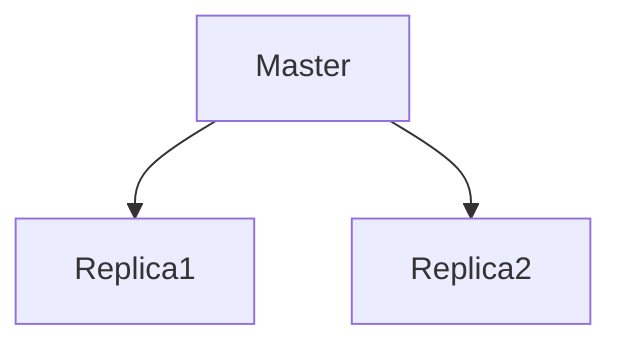
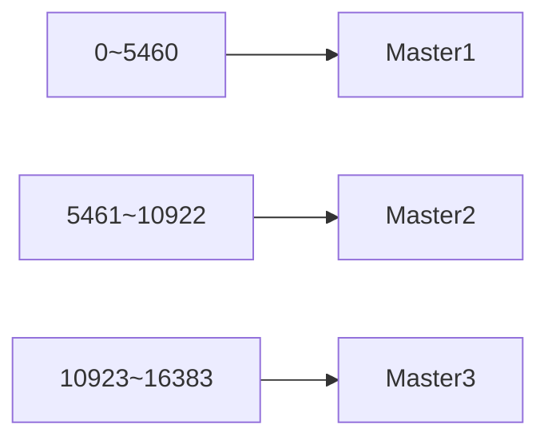
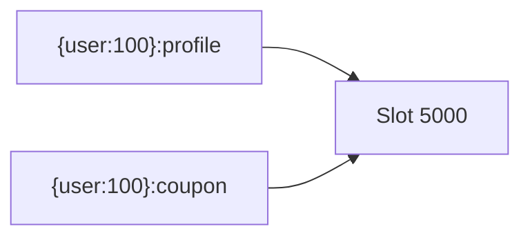
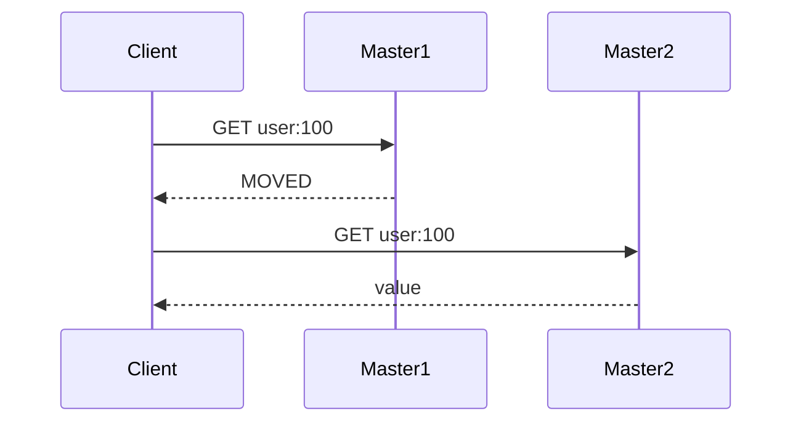
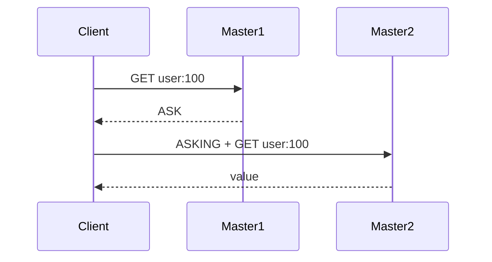
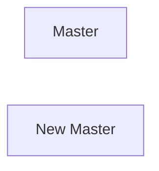

# 클러스터
## 레디스 클러스터와 확장성

### 스케일 업 vs 스케일 아웃

확장성(Scalability)은 증가하는 트래픽과 데이터 양에 유연하게 대응할 수 있는 능력을 의미한다.

### 스케일 업 (Scale Up)

서버의 CPU, 메모리 등 하드웨어 사양을 높이는 방식

```
Redis Server
CPU 4 Core
Memory 16GB

↓

CPU 16 Core
Memory 64GB
```

장점

- 구조가 단순
- 애플리케이션 수정 최소화

단점

- 물리적 한계 존재
- 비용 증가

### 스케일 아웃 (Scale Out)

서버 수를 늘려 부하를 분산하는 방식

```
Redis 1대

↓

Redis 3대
Redis 5대
Redis 10대
```

장점

- 수평 확장 가능
- 대용량 데이터 처리 가능

단점

- 운영 복잡도 증가

---

### 레디스에서의 확장성

Sentinel은 고가용성을 제공하지만 데이터는 여전히 하나의 Master에 저장된다.



즉

- 장애 복구 가능
- 데이터 분산 저장 불가
- 메모리 확장 불가

대용량 데이터 처리를 위해서는 Cluster가 필요하다.

---

### 레디스 클러스터의 기능

Redis Cluster는 다음 기능을 제공한다.

- 데이터 샤딩
- 자동 Failover
- 수평 확장
- 고가용성

---

# 레디스 클러스터 동작 방법

## 해시 슬롯을 이용한 데이터 샤딩

Redis Cluster는 Consistent Hashing 대신 Hash Slot 방식을 사용한다.

- 전체 슬롯 수 0 ~ 1638

각 Master는 슬롯 일부를 담당한다.



키 저장 과정

```
CRC16(key) % 16384
```

예시

```
user:100
↓
CRC16(user:100)
↓
Slot 3247
↓
Master1 저장
```

---

### 🤔 왜 16384개 슬롯일까?

노드가 추가되더라도 전체 데이터를 이동하는 것이 아니라 슬롯만 이동하면 되기 때문이다.

---

## 해시태그(Hash Tag)

Redis Cluster는 기본적으로 키 전체 문자열을 이용해 슬롯을 계산한다.

예시

```
user:100:profile
user:100:coupon
```

↓

서로 다른 슬롯 가능

```
profile → Slot 1000
coupon → Slot 9000
```

---

Hash Tag 사용

```
{user:100}:profile
{user:100}:coupon
```

Redis는 중괄호 내부 문자열만 사용한다.

```
CRC16(user:100)
```

↓

동일 슬롯



---

### 🤔 Hash Tag를 사용하는 이유

아래 명령은 모든 키가 동일 슬롯에 존재해야 한다.

```bash
MGET
MULTI
EVAL(LUA)
```

그렇지 않으면

```bash
(error) CROSSSLOT
```

오류가 발생한다.

---

## 자동 재구성

클러스터 노드가 추가되거나 제거되면 슬롯을 재배치한다.

!image.png

이를 리샤딩(Resharding)이라고 한다.

### **자동 페일오버**

!image.png

### **자동 복제본 마이그레이션**

!image.png

모든 마스터가 적어도 1개 이상의 복제본에 의해 복제되는 것을 보장한다.

```bash
cluster-allow-replica-migration yes
cluster-migration-barrier 1
```

- **cluster-allow-replica-migration** 옵션이 yes일 때 동작한다.
- **cluster-migration-barrier**는 복제본을 마이그레이션하기 전 마스터가 가지고 있어야 할 최소 복제본의 수를 의미한다.

# 클러스터 실행하기

---

## 클러스터 상태 확인하기

노드 정보 조회

```bash
CLUSTER NODES
```

클러스터 상태 확인

```bash
CLUSTER INFO
```

슬롯 확인

```bash
CLUSTER SLOTS
```

---

# 레디스 클러스터 운영하기

## 클러스터 리샤딩

슬롯을 다른 노드로 이동시키는 작업

```bash
redis-cli --cluster reshard 127.0.0.1:7000
```

## 클러스터 확장 - 신규 노드 추가

신규 노드 추가

```bash
redis-cli --cluster add-node \
127.0.0.1:7006 \
127.0.0.1:7000
```

---

추가 후

```bash
redis-cli --cluster reshard
```

실행

---

## 노드 제거하기

슬롯 이동 완료 후 제거

```bash
redis-cli --cluster del-node
```

---

### 🤔 왜 슬롯 이동 후 제거할까?

슬롯이 남아있는 상태에서는 노드를 제거할 수 없다.

---

## 레디스 클러스터로의 데이터 마이그레이션

기존 Standalone Redis

↓

Cluster 이전

사용 가능한 방법

- redis-shake
- redis-migrate-tool
- redis-cli MIGRATE

---

## 복제본을 이용한 읽기 성능 향상

!image.png

키를 저장한 마스터와 다른 마스터에서 읽어오려 하면 에러가 발생한다.

마스터에 데이터를 읽어가는 부하가 집중되는 경우

데이터를 쓰는 커넥션은 마스터에, 읽기는 복제본에서 수행할 수 있도록

**커넥션을 분배시켜 읽기 성능을 향상**시킬 수 있다.

→ **READONLY 모드**로 변경해 클라이언트가 복제본 노드에 있는 데이터를 직접 읽을 수 있게 한다.

---

# 레디스 클러스터 내부 동작 원리

### 클러스터 버스(Cluster Bus)

Redis Cluster는 일반 클라이언트 요청을 처리하는 포트와 별도로 클러스터 노드끼리 통신하기 위한 **클러스터 버스(Cluster Bus)** 를 사용한다.

클러스터 버스는 다음과 같은 용도로 사용된다.

- PING / PONG 전송
- Gossip Protocol 정보 전파
- 장애 감지
- Failover 관련 메시지 전달
- 슬롯 정보 전파

즉, 클라이언트 요청과 클러스터 내부 통신을 분리해 안정적으로 클러스터를 운영할 수 있도록 한다.

---

### 풀 메쉬 토폴로지(Full Mesh Topology)

!image.png

Redis Cluster는 **풀 메쉬(Full Mesh)** 구조로 동작한다.

즉 모든 노드는 서로를 알고 있으며 직접 연결된다.

따라서 특정 노드의 상태 변화나 슬롯 변경 정보가 클러스터 전체로 빠르게 전파될 수 있다.

---

### PING / PONG과 연결 재시도

클러스터 노드들은 주기적으로 PING 패킷을 전송하여 상대 노드의 상태를 확인한다.

만약 특정 노드의 PONG 응답이 지연되거나 일정 시간 내에 응답하지 않으면 해당 연결이 정상적인지 확인하기 위해 새로운 연결을 시도한다.

이를 통해 네트워크 장애나 연결 끊김을 빠르게 감지할 수 있으며, 이후 PFAIL → FAIL 판단 과정으로 이어질 수 있다.

### 🤔 왜 연결을 다시 시도할까?

일시적인 네트워크 지연이나 TCP 연결 문제일 수도 있기 때문이다.

Redis Cluster는 단순히 한 번의 응답 실패만으로 장애를 판단하지 않고, 새로운 연결 시도를 통해 실제 장애 여부를 확인한 뒤 PFAIL 상태로 전환한다.

## 하트비트 패킷

레디스 클러스터 노드들은 지속적으로 서로의 상태를 확인하기 위해 **PING, PONG 패킷**을 주고받는다.

이 두 패킷을 통틀어 하트비트(Heartbeat) 패킷이라고 한다.

클러스터는 이러한 하트비트 패킷을 통해

- 노드 생존 여부 확인
- 장애 감지
- 해시슬롯 정보 공유
- 클러스터 구성 동기화

를 수행한다.

### **하트비트 패킷 헤더 정보**

하트비트 패킷에는 다음 정보가 포함된다.

- 노드 ID
    - 클러스터 내에서 노드를 식별하는 고유 ID
- 현재 Epoch / Config Epoch
    - 클러스터 구성 버전 정보
    - 분산 환경에서 최신 구성을 판단하기 위해 사용
- 노드 플래그(Node Flag)
    - 노드 역할 정보
        
        ```
        master
        slave
        fail
        pfail
        myself
        ```
        
- 슬롯 비트맵(Slot Bitmap)
    - 마스터 노드가 담당하는 해시슬롯 정보
- TCP 포트
    - 클라이언트 요청을 처리하는 포트
- Cluster Bus 포트
    - 노드 간 통신에 사용하는 포트
- 클러스터 상태
    - 발신 노드가 인식하는 현재 클러스터 상태
        
        ```
        ok
        fail
        ```
        
- 마스터 노드 ID
    - 복제본인 경우 자신이 복제하는 마스터 정보

### 가십(Gossip) 섹션

하트비트 패킷에는 가십 섹션(Gossip Section)이 포함된다.

가십 섹션은 "내가 알고 있는 다른 노드 상태" 를 전달하는 역할을 한다.

예를 들어 Node A가 Node B에게 PING을 보낼 때 

```
Node C 상태
Node D 상태
Node E 상태
```

정보도 함께 전달한다.

```
Node A
 ├─ B는 정상
 ├─ C는 PFAIL
 └─ D는 정상
```

이런 식의 정보를 같이 전달한다.

### 🤔 왜 Gossip Protocol을 사용할까?

모든 노드가 모든 노드와 직접 상태를 확인하면

노드 수가 많아질수록 네트워크 비용이 급격히 증가한다.

Gossip Protocol은

```
일부 노드 정보만 전달
        ↓
정보가 점진적으로 확산
```

되는 방식이기 때문에 적은 비용으로 클러스터 전체 상태를 공유할 수 있다.

Redis Cluster에서는 어떤 노드가 어떤 슬롯을 소유하는가에 대한 정보가 모든 노드에서 동일해야 한다.

이를 위해 클러스터는 해시슬롯 구성을 지속적으로 전파한다.

## 해시슬롯 구성이 전파되는 방법

- **하트비트 패킷**: 마스터 노드가 PING, PONG 패킷을 보낼 때 항상 자기가 갖고 있는 해시슬롯을 패킷 데이터에 추가
- **업데이트 메시지**: 하트비트 패킷에는 발신하는 노드의 구성 에포크 값이 포함되어 있으며, 패킷을 보낸 노드의 에포크 값이 오래됐다면 해당 패킷을 받은 노드는 신규 에포크의 구성 정보를 포함한 업데이트 메시지를 노드에 보내 하트비트 패킷을 보낸 노드의 해시슬롯 구성을 업데이트

## 노드 핸드셰이크

CLUSTER MEET 커맨드를 수신한 노드는 자신이 알고 있는 **다른 노드들에게 전파**하고, 이 정보를 수신한 노드가 신규 합류한 노드를 모르는 상태라면 해당 노드와 CLUSTER MEET을 통해 **신규 연결**을 맺는다.

새 노드 추가 → MEET 패킷 전송 → 클러스터 참여

---

## 클러스터 라이브 재구성

클러스터가 정상적으로 운영되는 동안 새로운 마스터 노드를 추가하거나 기존 마스터 노드를 제거할 수 있다.

- **추가**: 빈 노드를 클러스터에 추가한 뒤, 일부 해시슬롯을 기존 마스터에서 신규 노드로 옮긴다.
- **제거**: 해당 노드를 빈 노드로 만들기 위해, 갖고 있던 해시슬롯을 다른 노드로 보낸다.

즉, 서비스 중단 없이

- 노드 추가
- 노드 제거
- 슬롯 이동

가능

---

## 리디렉션(Redirection)

Redis Cluster에서 클라이언트가 잘못된 노드로 요청을 보낸 경우, 올바른 노드로 요청을 전달할 수 있도록 리디렉션 정보를 반환한다.

대표적인 리디렉션은 다음 두 가지다.

- MOVED
- ASK

---

### MOVED 리디렉션

의미

```
요청한 해시 슬롯은
다른 노드가 담당하고 있으니

앞으로는 해당 노드로 요청해
```

클라이언트가 요청한 키의 해시 슬롯을 계산한 뒤, 해당 슬롯을 담당하는 마스터 노드 정보를 반환한다.

예시

```
user:100
↓
Slot 3247
↓
Master2 담당
```

하지만 클라이언트가 Master1으로 요청한 경우

```bash
GET user:100

(error) MOVED 3247 127.0.0.1:7001
```

응답 의미

```
3247번 슬롯은
7001 노드 담당

앞으로는 그쪽으로 요청해
```

---

### MOVED 발생 시 동작



클라이언트는 MOVED 응답을 받으면 내부적으로 가지고 있는 **Hash Slot 맵을 갱신**한다.

따라서 다음부터 동일 슬롯에 대한 요청은 새로운 노드로 바로 전송한다.

---

### 🤔 언제 발생할까?

- 클러스터 최초 연결
- 클라이언트 슬롯 정보가 오래된 경우
- 리샤딩 이후 슬롯 위치가 변경된 경우

---

### ASK 리디렉션

의미

```
지금 요청은 저 노드로 보내

하지만 다음 요청은
기존 노드로 다시 보내
```

ASK는 해시 슬롯 이동(Resharding) 과정에서만 발생한다.

슬롯이 완전히 이동하기 전 임시 상태에서 사용된다.

---

예시

```
Master1
↓
Slot 3000 이동 중
↓
Master2
```

이때 일부 데이터는 이미 Master2에 존재하고 있을 수 있다.

---

클라이언트 요청

```bash
GET user:100
```

응답

```bash
(error) ASK 3000 127.0.0.1:7001
```

---

### ASK 발생 시 동작



클라이언트는 ASK 응답을 받은 경우

```bash
ASKING
```

명령을 먼저 전송한 뒤 요청을 수행한다.

---

### 🤔 MOVED와 다른 점은?

ASK는 임시 리디렉션이다.

따라서 클라이언트는

```
Hash Slot 맵을 갱신하지 않는다.
```

현재 요청만 새로운 노드로 보내고,

다음 요청부터는 기존 노드로 다시 요청한다.

---

### MOVED vs ASK

| 구분 | MOVED | ASK |
| --- | --- | --- |
| 의미 | 슬롯이 완전히 이동됨 | 슬롯 이동 중 |
| 발생 시점 | 일반적인 슬롯 변경 후 | Resharding 진행 중 |
| 슬롯 맵 갱신 | O | X |
| 다음 요청 | 새로운 노드로 전송 | 기존 노드로 다시 전송 |
| 성격 | 영구 리디렉션 | 임시 리디렉션 |

---

### 🤔 왜 ASK가 필요할까?

리샤딩 중에는 슬롯 이동이 완전히 끝나지 않은 상태가 존재한다.

이때 무조건 MOVED를 반환하면 클라이언트가 슬롯 맵을 변경해 버리게 된다.

하지만 실제 데이터 이동이 아직 완료되지 않았을 수 있기 때문에 Redis는 ASK를 사용해 임시적으로 특정 요청만 새로운 노드에서 처리하도록 한다.

---

## 장애 감지와 페일오버

Redis Cluster는 Gossip Protocol과 하트비트 패킷을 이용해 장애를 감지한다.

장애 감지는 크게 두 단계로 진행된다.

---

### PFAIL 플래그

PFAIL(Possible Failure)은 특정 노드가 장애일 가능성이 있다고 판단한 상태이다.

즉,

```
내가 보기에는
저 노드가 죽은 것 같음
```

이라는 의미다.

특정 노드에 대해 `NODE_TIMEOUT` 시간 동안 응답을 받지 못하면 해당 노드를 PFAIL 상태로 표시한다.

예시

```
Node A
 ↓ PING

Node B
 ↓

응답 없음
```

↓

```
Node A
↓
PFAIL 판단
```

---

### 🤔 PFAIL 상태에서 바로 장애 처리하지 않는 이유

일시적인 네트워크 지연이나 연결 문제일 수 있기 때문이다.

따라서 Redis는 한 노드의 판단만으로 장애를 확정하지 않는다.

---

### RTT와 NODE_TIMEOUT

RTT(Round Trip Time)

```
PING
↓
PONG
```

까지 걸리는 시간

Redis Cluster에서는 `NODE_TIMEOUT > RTT` 관계를 유지해야 한다.

만약 RTT보다 `NODE_TIMEOUT`이 너무 짧다면 정상 노드도 장애로 오인할 수 있다.

---

### FAIL 플래그

FAIL은 클러스터 전체가 해당 노드의 장애를 인정한 상태이다.

즉

```
저 노드는
실제로 장애가 발생했다
```

고 판단한 상태다.

---

노드 A가 Node B를 PFAIL로 판단한 경우

다른 노드들의 Gossip 정보를 확인한다.

```
Node C
↓
B를 PFAIL 판단

Node D
↓
B를 PFAIL 판단
```

---

일정 시간 내에 여러 노드가 B의 장애를 보고하면

```
PFAIL
↓
FAIL
```

로 전환된다.

---

### 🤔 왜 FAIL 상태가 되어야 할까?

Failover는 FAIL 상태에서만 시작된다.

PFAIL은 단순 의심 상태이고,

FAIL은 클러스터가 공식적으로 장애를 인정한 상태이다.

따라서 실제 마스터 교체는 FAIL 이후에만 가능하다.

---

## 복제본 선출 조건

FAIL 상태가 되었다고 해서 모든 Replica가 Master가 될 수 있는 것은 아니다.

복제본은 아래 조건을 만족해야 한다.

### 1. 마스터가 FAIL 상태

```
Master
↓
FAIL
```

상태여야 한다.

---

### 2. 마스터가 해시 슬롯 보유

장애가 발생한 Master가 최소 1개 이상의 해시 슬롯을 갖고 있어야 한다.

슬롯이 없는 Master는 승격 대상이 아니다.

---

### 3. 복제가 너무 오래 끊어지지 않았을 것

Master와 Replica 간 복제가 오랫동안 끊어져 있었다면

```
데이터 최신성 보장 불가
```

상태가 된다.

따라서 해당 Replica는 승격 대상에서 제외될 수 있다.

---

## 복제본 선출 과정

FAIL 상태가 되면 Replica는 새로운 Master가 되기 위해 투표를 요청한다.

### 1단계. 투표 요청

Replica는 모든 Master에게 `FAILOVER_AUTH_REQUEST` 패킷을 보낸다.

---

### 2단계. 투표 응답

Master는 `FAILOVER_AUTH_ACK` 을 반환해 동의를 알린다.

- `NODE_TIMEOUT`*2시간 동안은 같은 마스터로 승격되고자 하는 다른 복제본에게는 투표할 수 없다.

---

### 3단계. 과반수 확보

Replica는 과반수 이상의 Master에게 동의를 받아야 한다.

```json
- Master1: 찬성
- Master2: 찬성
- Master3: 반대

→ 과반수 확보 → 승격 성공
```

---

### 4단계. 새로운 Master 승격

### 🤔 왜 여러 Replica가 동시에 Master가 되지 않을까?

Master는 NODE_TIMEOUT * 2 기간 동안 동일 장애에 대해 한 번만 투표할 수 있다.

따라서 동시에 여러 Replica가 승격되는 Split Brain 상황을 방지할 수 있다.

---

## 복제본 선출 우선순위

모든 Replica가 동시에 투표를 시작하지는 않는다.

각 Replica는 일정 시간 대기 후 선거를 시작한다.

```
DELAY = 500ms + 랜덤 지연(0~500ms) + SLAVE_RANK × 1000ms
```

---

### SLAVE_RANK

Master로부터 가장 많은 데이터를 복제한 Replica일수록 우선순위가 높다.

즉, 복제 데이터가 많을수록 SLAVE_RANK가 낮아지고 더 빨리 투표를 시작한다.

---

예시

```
Replica1(SLAVE_RANK=0)
Replica2(SLAVE_RANK=1)
Replica3(SLAVE_RANK=2)
```

실제 투표 시작 순서

```
Replica1 → Replica2 → Replica3
```

### 🤔 왜 이런 방식일까?

장애 직전까지 가장 최신 데이터를 가지고 있던 Replica를 우선적으로 Master로 승격하기 위해서다.

이를 통해 데이터 유실 가능성을 최소화할 수 있다.

!image.png

---

## Split Brain

네트워크 분리로 인해 Master가 두 개가 되는 현상


↓



Redis Cluster는 과반수 투표를 통해 Split Brain을 최소화한다.
