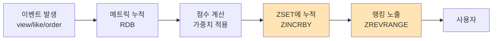
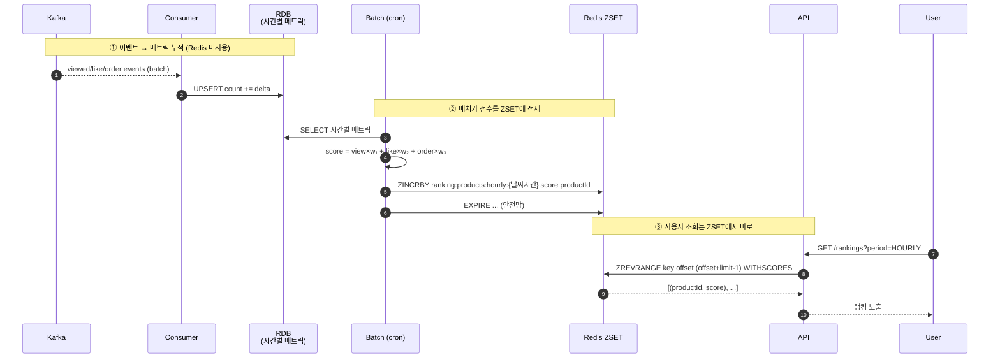
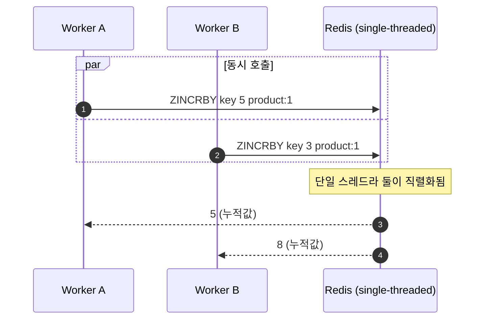
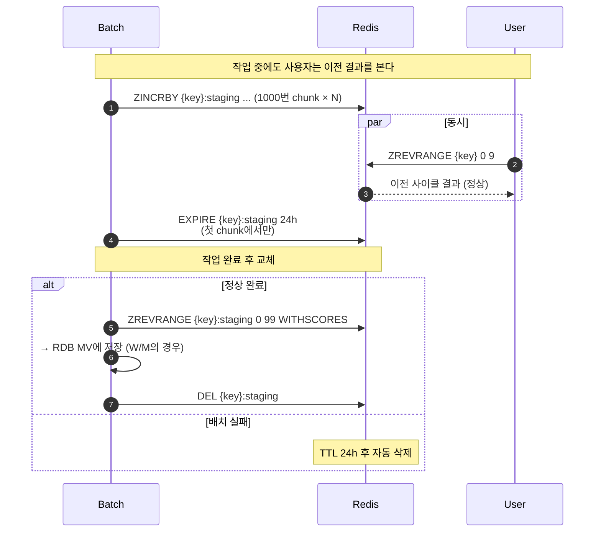
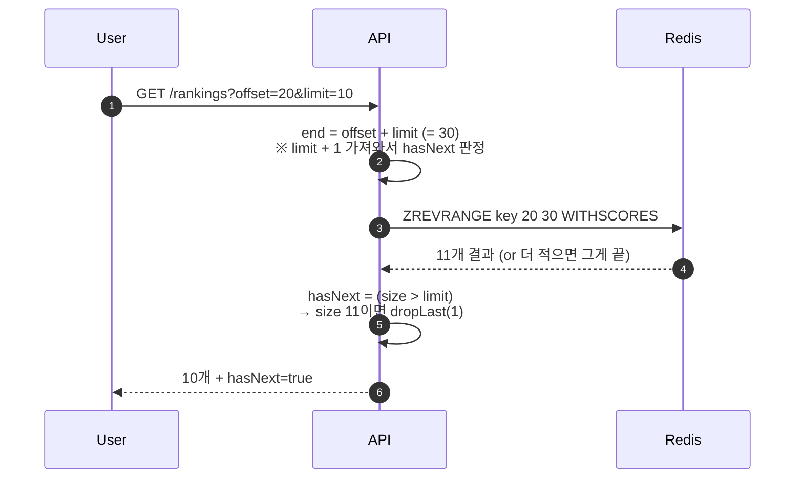
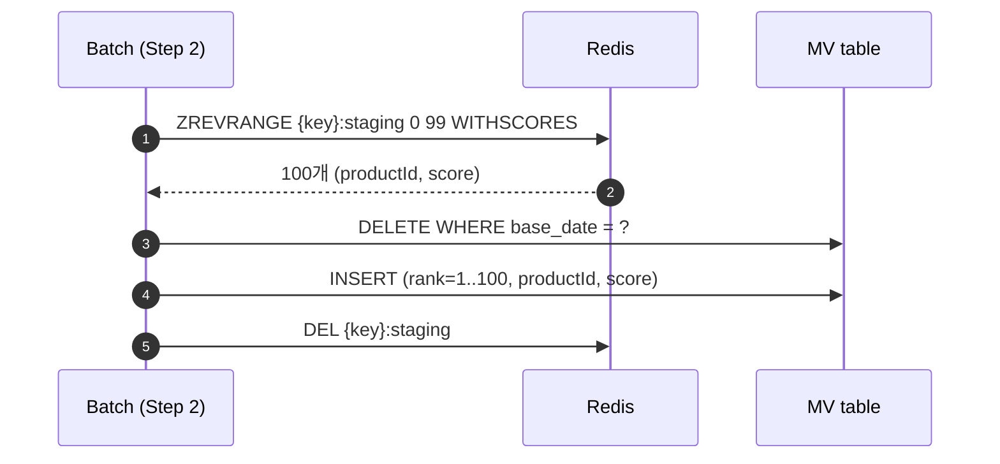
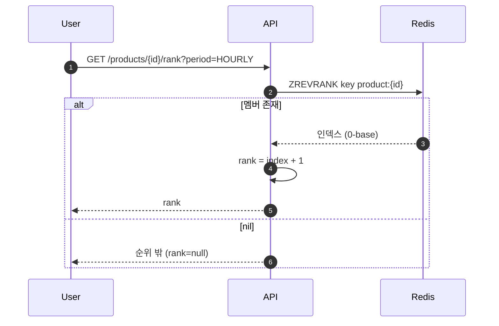
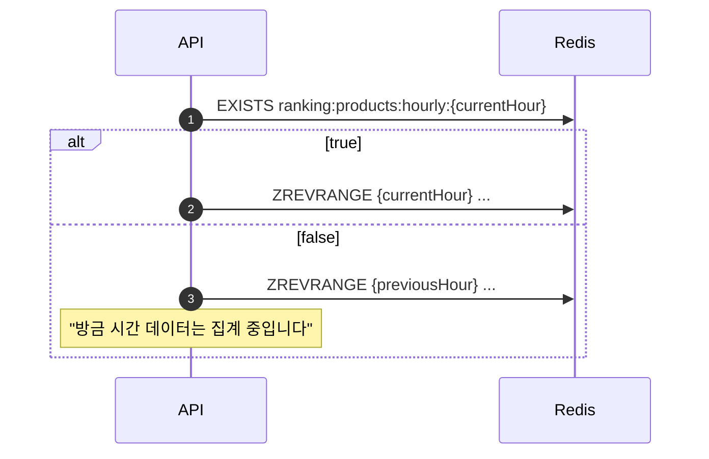

# [3주차] 레디스 자료 구조 활용 사례 — Sorted Set으로 랭킹 시스템 만들기

> 4장 "레디스 자료 구조 활용 사례"를 학습하면서, **상품 인기 랭킹**을 만들 때 Redis가 어디에 어떻게 쓰이는지 정리한다. 전체 시스템 그림을 먼저 그리고, **Redis가 실제로 호출되는 지점마다 "어떤 명령어를 왜 쓰는가"**를 따라간다.

- 참고 도서: 『개발자를 위한 레디스』 4장 (pp.97~128)
- 구체 예시 코드: [Loopers L2 vol2 PR #75](https://github.com/Loopers-dev-lab/loop-pack-be-l2-vol2-kotlin/pull/75) (코드 인용은 패턴 설명에 필요한 최소만)

---

## 0. 왜 랭킹에 Redis인가

랭킹의 본질은 두 가지 연산이다.

1. **점수가 끊임없이 변한다** — 사용자가 상품을 보고, 좋아요를 누르고, 주문할 때마다 점수를 바꿔야 한다.
2. **"점수 순으로 N개"를 빠르게 뽑아야 한다** — 인기 TOP 100, 페이지네이션, 내 상품 순위.

RDB로 풀면 둘 다 비싸다. 점수 갱신은 row lock 경합, TOP N은 `ORDER BY score DESC LIMIT 100` 풀스캔/인덱스. 데이터가 커질수록 두 연산 모두 선형으로 느려진다.

Redis의 **Sorted Set (ZSET)**은 정확히 이 두 연산을 위해 설계된 자료구조다. 내부적으로 skip list + hash table을 써서:
- 점수 갱신 `O(log N)`
- TOP N 조회 `O(log N + N)`
- 특정 멤버의 순위 조회 `O(log N)`

이게 책 4장이 ZSET을 "랭킹 자료구조"로 처음에 꺼내는 이유다.

---

## 1. 전체 흐름 — Redis가 어디에 들어가는가

랭킹 시스템 한 사이클을 끝까지 그리면 다음 4단계가 된다.



**Redis가 들어가는 구간은 ② 끝과 ③ 두 곳뿐이다** (주황색). 이벤트 소비도, 가중치 계산도 Redis가 아니다. 이 분리가 중요한 이유는 §7에서 다룬다.

좀 더 구체적으로, 컴포넌트를 추가한 시퀀스:



이제 ②와 ③의 각 Redis 호출을 하나씩 본다. **각 절은 "명령어 → 의도 → 시퀀스 → 코드 발췌"** 순서로 진행.

---

## 2. 점수 누적 — `ZINCRBY`

### 명령어
```redis
ZINCRBY ranking:products:hourly:2026043020 12.5 product:1042
```

`key`의 `member`(`product:1042`)에 `12.5`를 더한다. 멤버가 없으면 0에서 시작.

### 의도
랭킹 점수는 **여러 소스에서 동시에 더해진다**. 같은 시간대에 1042번 상품이 100번 조회되고, 50번 좋아요 받고, 10번 주문되면 그 점수들이 누적되어야 한다.

`GET → 계산 → SET` 패턴이면 **race condition**이 생긴다. 두 워커가 동시에 GET 한 뒤 각자의 결과를 SET 하면 한쪽 갱신이 사라진다 (lost update). `ZINCRBY`는 Redis 단일 스레드 모델 안에서 **원자적**으로 누적되므로 이 문제가 원천 차단된다.

또 하나, 점수가 처음인 멤버를 위해 `ZADD`로 0을 넣고 시작할 필요가 없다. `ZINCRBY`가 멤버 부재를 0으로 처리한다. 코드가 한 줄 짧아진다.

### 시퀀스


### 본 시스템에서의 호출
배치 잡이 시간별 메트릭을 chunk(1000건) 단위로 읽어서, **chunk 안의 각 row마다 한 번씩 `ZINCRBY`**를 호출한다.

```kotlin
// RedisAggregationWriter#write (요약)
chunk.items.forEach { entry ->
    zSetOps.incrementScore(stagingKey, entry.productId.toString(), entry.score.toDouble())
}
```

**개선 여지**: chunk당 1000번의 라운드트립이 발생한다. `redisTemplate.executePipelined { ... }`로 묶으면 한 번에 보낼 수 있다. 책 4장 예시는 단건 호출만 보여주지만, 실무에선 파이프라이닝이 사실상 필수.

---

## 3. 작업 키 격리 — `:staging` 접미사 + `EXPIRE`

### 명령어
```redis
ZINCRBY ranking:products:weekly:20260430:staging 12.5 product:1042
EXPIRE  ranking:products:weekly:20260430:staging 86400
```

스테이징 키에 점수를 다 채운 뒤, 마지막에 `RENAME staging → live` (또는 본 시스템처럼 RDB로 떨어뜨리고 `DEL staging`)로 노출 키를 한 번에 교체.

### 의도
배치가 ZSET을 처음부터 채우는 동안, 사용자가 같은 키를 읽으면 **반쯤 만들어진 랭킹**이 노출된다. 100위까지 보여줘야 하는데 30위까지만 채워진 상태가 보일 수 있다.

해결: **작업용 키와 노출용 키를 분리**한다. 관용적으로 `:staging`, `:tmp`, `:building` 같은 접미사를 쓴다.

`EXPIRE`로 TTL을 거는 이유는 다른 데 있다 — **배치가 중간에 죽으면 스테이징 키가 영원히 남는다**. 메모리는 무한이 아니니까 안전망이 필요하다. TTL 24h면 다음 사이클까지는 자동 정리된다.

### 시퀀스


### 본 시스템에서의 호출
```kotlin
// RedisAggregationWriter#write (요약)
if (redisTemplate.getExpire(stagingKey) == -1L) {
    redisTemplate.expire(stagingKey, 24, TimeUnit.HOURS)
}
```

`getExpire == -1L`(TTL 미설정)인 첫 chunk에서만 EXPIRE를 호출하는 idempotent 패턴. 같은 chunk가 재시도돼도 TTL이 리셋되지 않는다.

---

## 4. TOP N 추출 — `ZREVRANGE ... WITHSCORES`

### 명령어
```redis
ZREVRANGE ranking:products:hourly:2026043020 0 99 WITHSCORES
```

점수 **내림차순**으로 인덱스 0~99 (=TOP 100). `WITHSCORES`는 결과에 점수도 포함.

### 의도
"인기 상품 100개"는 **순위 N개**가 필요한 거지 "점수 800점 이상"이 아니다. 그래서 점수 조건 조회인 `ZRANGEBYSCORE`가 아니라 **인덱스 기반의 `ZREVRANGE`**가 맞다.

`ZREVRANGE`는 끝 인덱스 **포함**(inclusive)이라는 점이 헷갈린다. `0 99`는 100개. `0 -1`은 전체.

`WITHSCORES`를 붙이는 이유는 두 가지다:
1. UI에 점수를 같이 노출해야 하는 경우 (eg. 게임 점수)
2. **재계산이나 RDB 저장이 필요할 때** — 본 시스템에서 주간/월간 랭킹은 ZSET TOP 100을 점수와 함께 RDB MV 테이블에 저장한다. 점수 없으면 다음 사이클에서 재구성 못 함.

### 시퀀스 — 사용자 조회 (페이지네이션)


`limit + 1`을 가져와서 마지막 한 건을 잘라내는 트릭은 **cursor 없이 offset 기반 페이지네이션 + hasNext** 플래그를 동시에 만드는 가장 간단한 방법. cursor 기반(`ZSCAN`)은 더 정교하지만 페이지 뛰어가기 같은 UI엔 부적합.

### 시퀀스 — 배치 영속화 (W/M)


ZSET → RDB로 옮기는 이유는 §7에서 다룬다.

### 본 시스템에서의 호출
```kotlin
// ProductRankingProxyReader#findFromRedis (요약)
val end = query.offset + query.limit + 1 - 1  // = offset + limit
zSetOps.reverseRangeWithScores(bucketKey, query.offset, end)
    ?.mapIndexedNotNull { index, tuple ->
        ProductRanking(
            productId = tuple.value.toLong(),
            rank = (query.offset + index + 1).toInt(),
            score = BigDecimal.valueOf(tuple.score),
        )
    }
```

순위(`rank`)는 ZSET이 안 돌려준다 (인덱스만). offset과 루프 인덱스로 직접 계산. 1-base UI라 `+1`.

---

## 5. 개별 순위 조회 — `ZREVRANK`

### 명령어
```redis
ZREVRANK ranking:products:hourly:2026043020 product:1042
```

내림차순 기준에서 해당 멤버의 인덱스를 돌려준다 (0-base). 멤버가 없으면 `nil`.

### 의도
"내 상품이 지금 몇 등이지?"를 **TOP N 전체를 안 가져오고** 알 수 있다. ZSET 내부 skip list를 타고 멤버 위치만 찾는 `O(log N)` 연산.

UI 용도뿐 아니라:
- "100위 안에 들었으면 알림 보내기" 같은 임계값 체크
- A/B 테스트에서 "특정 상품의 가시성 변화" 측정

### 시퀀스


### 본 시스템에서의 호출
```kotlin
// ProductRankingProxyReader#findRankFromRedis
val rank = zSetOps.reverseRank(bucketKey, productId.toString()) ?: return null
return (rank + 1).toInt()
```

---

## 6. 데이터 가용성 확인 — `EXISTS`

### 명령어
```redis
EXISTS ranking:products:hourly:2026043020
```

### 의도
**아직 배치가 안 돈 시간대**를 조회하면 빈 결과가 나온다. 사용자에겐 "이전 시간대로 폴백"이나 "현재 시간대는 집계 중입니다" 같은 응답을 줘야 하는데, 그 분기를 위해 키 존재 여부를 본다.

### 시퀀스 (폴백 패턴 예시)


### 단점과 대안
이 패턴은 **라운드트립 1회를 추가로 쓴다**. 어차피 다음 줄에서 `ZREVRANGE`를 부를 거면 그냥 `ZREVRANGE` 결과가 비었는지로 분기해도 같은 효과다. `EXISTS`는 "결과가 비었지만 데이터는 있는" 상태(예: 빈 ZSET이 아니라 키 자체가 없음)를 구별해야 할 때만 의미가 있다. 본 시스템엔 빈 ZSET 케이스가 사실상 없으므로 `EXISTS` 호출을 제거하는 것도 검토 가능.

---

## 7. Redis가 쓰이지 **않는** 구간 — 결정 근거

같은 시스템 안에서 어디는 Redis를 쓰고 어디는 안 쓰는지가 더 중요한 학습 포인트다.

### 7.1 이벤트 소비 → RDB UPSERT (Redis 미사용)
**Kafka 컨슈머가 ZINCRBY를 직접 부르지 않는다.** Consumer는 RDB의 `product_hourly_metric`에 `count = count + delta`로 UPSERT만 한다.

이유: **Kafka는 at-least-once 전달이라 같은 이벤트가 두 번 올 수 있다.**
- ZSET에 ZINCRBY로 두 번 더하면 점수가 **두 배가 된다** (멱등 X).
- RDB UPSERT는 `ON DUPLICATE KEY UPDATE`로 같은 (productId, hour, eventId) 키에 대해 한 번만 더하도록 막을 수 있다 (멱등 O).

배치가 RDB에서 시간별로 합산해서 ZSET에 넣을 때는 한 시간이 끝난 뒤 한 번만 도므로 멱등성 걱정이 없다. **멱등 책임을 RDB 쪽으로 몰아넣은 설계.**

### 7.2 주간/월간 → RDB MV table (Redis 미사용)
시간별/일별 ZSET은 변동이 많아서 ZSET이 압도적으로 유리하지만, **주간/월간은 한 번 계산되면 그 주/달 동안 변하지 않는다**. 조회 빈도도 낮다.

이걸 ZSET으로 영구 보관하는 비용:
- 메모리 = 주당 1키 × TOP 100 + 월당 1키 × TOP 100 = 영구 잔존
- 휘발성 = Redis 인스턴스 사고 시 재계산 필요

대안 — RDB의 MV 테이블에 TOP 100만 떨궈 두면:
- MySQL의 인덱스(B-Tree)로 100건 조회는 충분히 빠름
- 영구 보관 비용이 RDB 디스크 (싸다)
- 인스턴스 사고로부터 안전

이게 본 시스템에서 H/D는 ZSET, W/M은 RDB MV로 갈라진 이유. **"휘발성 + 빈번한 변경" → ZSET, "영속성 + 드문 조회" → RDB**라는 일반 원칙의 적용.

### 7.3 책 4장의 `ZUNIONSTORE` 패턴은?
책에서는 **일별 ZSET들을 `ZUNIONSTORE`로 합쳐 주간 ZSET을 만드는** 패턴을 소개한다. 본 시스템은 이걸 안 쓰고 RDB에서 SQL `SUM`으로 합산한 뒤 한 번에 ZSET에 적재하는 방식을 택했다.

선택의 이유:
- **가중치 동적 변경 가능**: 운영 중 가중치를 바꾸면 과거 점수를 새 가중치로 재계산해야 한다. ZSET에 누적된 점수는 원본 카운트가 사라져 재계산 불가. RDB는 raw count가 남아 있어 어떤 가중치로든 재계산 가능.
- **연산 비용 직관**: 168시간(1주) ZSET 합산보다 SQL `GROUP BY product_id` 한 번이 운영 직관에 가까움.

다만 **가중치가 고정**인 도메인(게임 일일 점수 → 주간 종합)에선 `ZUNIONSTORE`가 압도적이다. 도메인이 결정.

---

## 8. 책 4장 절 ↔ 본 시스템 사용 명령어 매핑

| 책 절 (4장)                                  | 본 시스템에서 등장하는가 | 본 시스템에서 쓰는 명령어        |
|----------------------------------------------|------------------------|----------------------------------|
| 데이터 업데이트 (`ZINCRBY` 기본 패턴)        | ✅                     | `ZINCRBY` (§2)                   |
| 랭킹 합산                                    | ❌ (RDB로 대체)         | (`ZUNIONSTORE` 미사용 — §7.3)    |
| `sorted set`을 이용한 최근 검색 기록         | ❌ (이번 도메인 밖)     | `ZADD` + score=timestamp 패턴    |
| `sorted set`을 이용한 태그 기능              | ❌                     | -                                |
| 랜덤 데이터 추출                             | ❌                     | -                                |
| 좋아요 처리하기                              | △ (이벤트로 우회)       | (RDB upsert로 처리, ZSET 미사용) |
| 읽지 않은 메시지 수 카운팅                   | ❌                     | -                                |
| DAU 구하기                                   | ❌                     | -                                |
| HyperLogLog 미터링                           | ❌                     | -                                |
| Geospatial Index                             | ❌                     | -                                |

이 PR이 4장 전체를 다루지는 않는다. **ZSET 절(데이터 업데이트, 랭킹 합산)이 핵심**이고 나머지는 다른 도메인에 적합하다.

추가로 본 시스템에서 등장하지만 책 4장에 명시적으로는 안 나오는 패턴들:

| 패턴            | 명령어                  | 의도                       |
|-----------------|-------------------------|----------------------------|
| TOP N + 페이지  | `ZREVRANGE WITHSCORES`  | UI 페이지네이션            |
| 개별 순위 조회  | `ZREVRANK`              | "몇 등이지" 즉답           |
| 작업 키 격리    | `:staging` + `EXPIRE`   | 작업 중 vs 노출 분리       |
| 작업 키 정리    | `DEL` (or TTL fallback) | 영속화 후 메모리 회수      |
| 가용성 확인     | `EXISTS`                | 빈 시간대 폴백 분기        |

---

## 9. 다음 주차로 넘어갈 연결고리

- **5장 (캐시)**: 본 시스템의 W/M 조회는 Cache-Aside 패턴 위에 올려져 있는데, "빈 결과는 캐시하지 않는다", "캐시 DTO를 versioned (CachedRankingV1)로 둔다" 같은 결정이 5장 내용과 직결.
- **7장 (백업)**: ZSET 스테이징 키 TTL 24h가 RDB 정합성 안전망. Redis가 죽어도 RDB 원본 메트릭으로 재실행 가능 — 이게 영속성 설계의 핵심.
- **10장 (클러스터)**: `ranking:products:{period}:{date}` 키가 단일 슬롯에 몰리지 않도록 클러스터 환경에선 hash tag 전략 재검토 필요.

---

## 부록 — 빠른 참조

**Redis 명령어 한 줄 요약 (이 시스템에서 본 용도 기준)**

| 명령어                          | 한 줄 의도                                         |
|---------------------------------|----------------------------------------------------|
| `ZINCRBY key score member`      | 멤버 점수에 원자적으로 누적 (없으면 0에서 시작)    |
| `ZREVRANGE key start stop WITHSCORES` | 점수 내림차순 인덱스 범위, TOP N + 페이지네이션 |
| `ZREVRANK key member`           | 내림차순 기준 멤버의 0-base 인덱스                |
| `EXPIRE key seconds`            | 작업/임시 키의 안전망 TTL                          |
| `DEL key`                       | 영속화 완료 후 명시적 정리                         |
| `EXISTS key`                    | 폴백 분기를 위한 가용성 체크 (※ 라운드트립 비용 주의) |

**언제 ZSET이 답이 아닌가**
- 멱등성이 필요한 입력 (Kafka at-least-once) → RDB UPSERT로 받은 뒤 배치로 ZSET 적재
- 한 번 만들면 거의 안 변하는 결과 → RDB 영속화 + Cache-Aside
- 가중치 사후 변경 가능성 → 원본 카운트를 RDB에 남겨야 함
