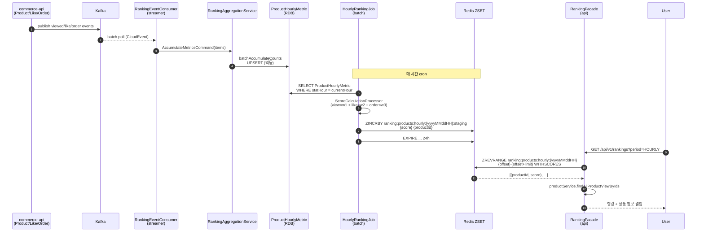
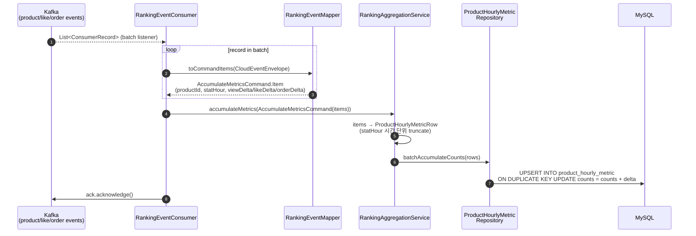
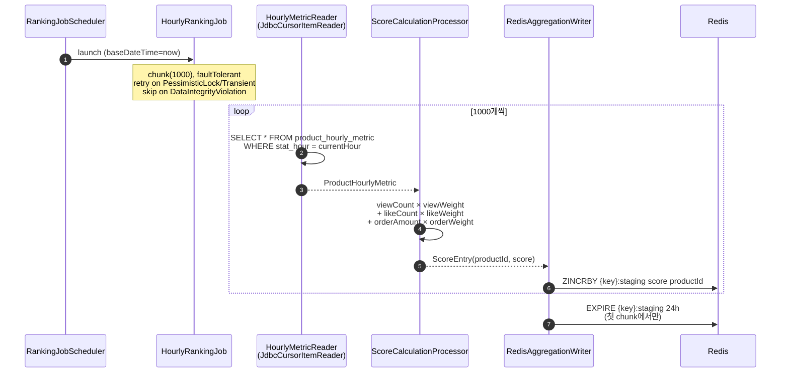
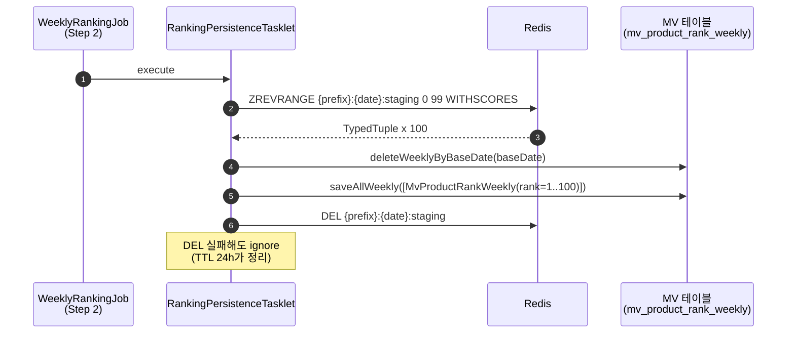
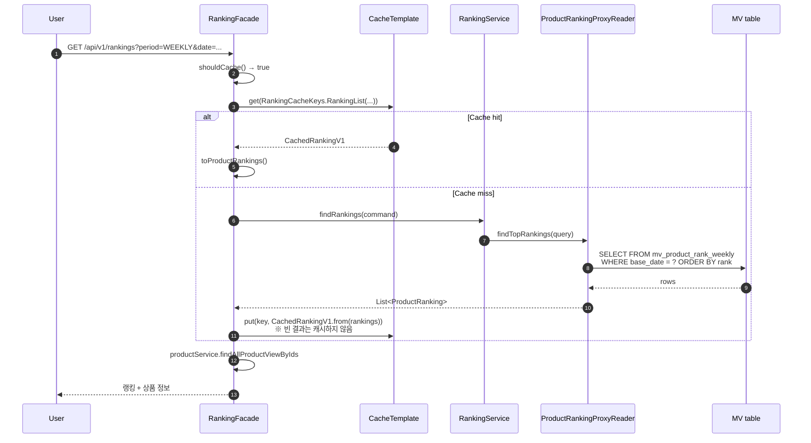
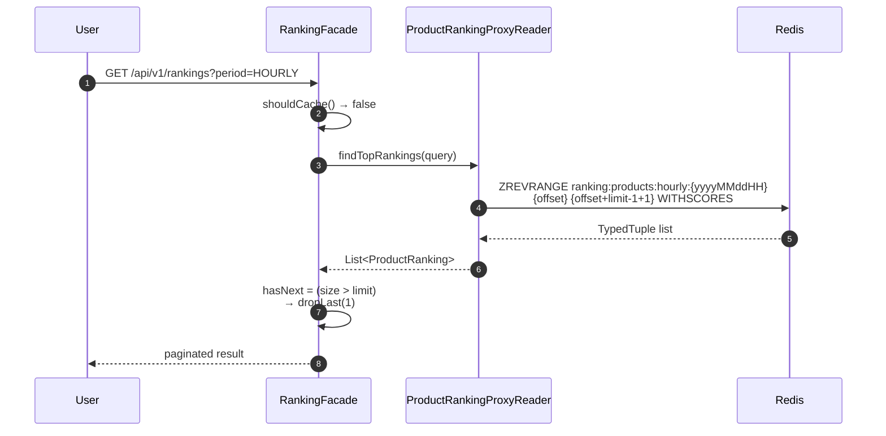

# [3주차] 레디스 자료 구조 활용 사례 — Sorted Set 기반 상품 랭킹

> 4장 "레디스 자료 구조 활용 사례"를 학습하면서, 같은 시기에 진행한 Loopers L2 vol2 PR로 만든 **상품 인기 랭킹 시스템**을 같이 정리한다. 책의 리더보드/카운팅 절들이 실제 운영급 코드에서 어떻게 풀리는지 매핑하는 것이 목적.

- **참고 PR**: [Loopers-dev-lab/loop-pack-be-l2-vol2-kotlin#75](https://github.com/Loopers-dev-lab/loop-pack-be-l2-vol2-kotlin/pull/75) (additions 12,239)
- **참고 도서**: 『개발자를 위한 레디스』 4장 (pp.97~128)

---

## 1. 시스템 개요

### 1.1 멀티 모듈 구조

```
commerce-api/      ← 사용자 조회 API (Redis ZSET 읽기)
commerce-streamer/ ← Kafka 이벤트 소비 → RDB 누적
commerce-batch/    ← Spring Batch로 RDB → Redis 점수 집계
```

이벤트 발생 → 메트릭 누적 → 점수 계산 → 랭킹 노출이 **세 단계 모두 다른 모듈**에서 일어난다. "집계와 계산을 분리한다" 원칙을 모듈 경계로 강제한 셈이다.

### 1.2 기간(period)에 따른 저장소 분기

| Period   | 저장소        | 갱신 주기 | 캐시        |
|----------|---------------|-----------|-------------|
| HOURLY   | Redis ZSET    | 매 시간   | (불필요)    |
| DAILY    | Redis ZSET    | 매일      | (불필요)    |
| WEEKLY   | RDB MV table  | 매주      | Cache-Aside |
| MONTHLY  | RDB MV table  | 매월      | Cache-Aside |

**왜 W/M만 RDB?** 책 4장에서도 강조하지만 ZSET은 휘발성 + 메모리 비용이 있다. 한 번 계산하면 한 달간 변하지 않는 월간 랭킹을 ZSET에 영구 보관할 이유가 없어, **TOP 100만 RDB MV(materialized view) 테이블로 떨궈** 영속화하고 ZSET 스테이징 키는 TTL 24h 후 자동 만료시킨다.

---

## 2. 전체 시퀀스 — Event → Ranking



**핵심 설계 결정 3가지:**

1. **이벤트 소비는 RDB에만 쓴다.** Consumer에서 직접 `ZINCRBY`를 호출하지 않는 이유 — 멱등성을 RDB UPSERT(`ON DUPLICATE KEY UPDATE`)로 처리하면 Kafka 재처리에 강하다. ZSET은 멱등성이 없어서 재소비 시 점수가 두 번 더해진다.
2. **점수 계산은 배치가 한다.** 가중치(`view/like/order`)를 운영 중에 바꿀 수 있어야 하므로, 가중치 변경 후 다음 배치 사이클부터 자연스럽게 반영된다.
3. **스테이징 키 + TTL.** `:staging` 접미사로 작업 중 키와 노출 키를 분리. 배치 실패해도 24h TTL로 자동 정리.

---

## 3. Redis 명령어 인벤토리

PR #75에서 실제 호출되는 Redis 명령어를 코드 위치와 함께 정리.

### 3.1 쓰기 (Batch)

| 명령어 | 호출 위치 | 용도 |
|--------|-----------|------|
| `ZINCRBY key score member` | `RedisAggregationWriter#write` | 같은 productId에 대해 여러 chunk에 걸쳐 점수 누적. RDB의 `ProductHourlyMetric`을 시간 단위로 합산할 때 사용 |
| `EXPIRE key 86400` | 〃 (첫 chunk에서만) | 스테이징 키 TTL 24h. `getExpire == -1L`로 미설정 상태일 때만 호출해 idempotent |
| `DEL key` | `RankingPersistenceTasklet#deleteStagingKey` | RDB 영속화 완료 후 스테이징 키 정리 (실패해도 TTL이 처리) |

### 3.2 쓰기 (Persistence Step, W/M 전용)

| 명령어 | 호출 위치 | 용도 |
|--------|-----------|------|
| `ZREVRANGE key 0 99 WITHSCORES` | `RankingPersistenceTasklet#fetchTopRankingsFromRedis` | 스테이징 키에서 TOP 100을 점수 내림차순으로 추출 → MV 테이블에 INSERT |

### 3.3 읽기 (API)

| 명령어 | 호출 위치 | 용도 |
|--------|-----------|------|
| `ZREVRANGE key offset (offset+limit-1) WITHSCORES` | `ProductRankingProxyReader#findFromRedis` | 페이지네이션 랭킹 목록 조회. `limit + 1`을 가져와서 `hasNext` 판정 |
| `ZREVRANK key member` | `ProductRankingProxyReader#findRankFromRedis` | 특정 상품의 현재 순위. 0-base 결과에 +1 |
| `EXISTS key` (RedisTemplate.hasKey) | `ProductRankingProxyReader#existsInRedis` | 해당 시간/일자의 랭킹 데이터 존재 확인. 폴백 분기에 사용 |

### 3.4 키 스킴

```
# 라이브 (조회용)
ranking:products:hourly:{yyyyMMddHH}     # KST
ranking:products:daily:{yyyyMMdd}
ranking:products:weekly:{yyyyMMdd}        # MV 만들기 전 임시
ranking:products:monthly:{yyyyMMdd}       # MV 만들기 전 임시

# 스테이징 (배치 작업용, TTL 24h)
ranking:products:{period}:{date}:staging
```

`RankingKeyGenerator`가 `Asia/Seoul` 타임존을 강제 적용. UTC로 키를 만들면 자정 경계에서 사용자 인식과 어긋나는 사고가 잘 난다.

---

## 4. 시퀀스 다이어그램별 상세

### 4.1 이벤트 → 메트릭 누적 (Consumer)



**여기서 Redis는 등장하지 않는다.** 이벤트 소비 단계는 순수 RDB 작업. 이게 중요한 게 — Kafka 재처리 시 같은 이벤트가 다시 와도 UPSERT가 멱등이라 데이터 정합성이 깨지지 않는다.

### 4.2 배치 점수 집계 — HourlyRankingJob



**ZINCRBY를 chunk마다 N번 호출하는 게 비효율 아닌가?** 1000건 chunk면 라운드트립 1000번이다. 개선 여지 있음 — `redisTemplate.executePipelined`로 묶으면 한 번에 보낼 수 있다. 책 4장의 ZINCRBY 절에서도 단일 호출 예시만 보여주는데, 실무에선 파이프라이닝이 거의 필수.

### 4.3 배치 영속화 — Weekly/Monthly Step 2



**`ZRANGEBYSCORE`가 아니라 `ZREVRANGE`인 이유**: 점수 자체가 아니라 "TOP N개"를 원하므로 인덱스 기반 조회가 맞다. `ZRANGEBYSCORE`는 "점수 800 이상" 같은 조건 조회용.

### 4.4 API 조회 — Cache-Aside (W/M)



**`CachedRankingV1`이 따로 있는 이유**: 도메인 객체(`ProductRanking`)를 그대로 캐시 직렬화하면 도메인 변경 시 역직렬화 깨진다. V1 DTO를 두면 스키마 진화할 때 `CachedRankingV2`를 추가하고 점진 전환 가능. 책 5장(다음 주차)의 캐시 운영 패턴과 연결되는 지점.

### 4.5 API 조회 — Direct Read (H/D)



**`limit + 1`을 가져오는 이유**: `hasNext` 플래그를 만들기 위해 한 건을 더 가져오고 마지막을 잘라낸다. cursor 없이 offset 기반 페이지네이션 + hasNext 플래그를 동시에 지원하는 가장 간단한 방법.

---

## 5. 책 4장 절 인덱스 ↔ 본 PR 매핑

『개발자를 위한 레디스』 4장 "레디스 자료 구조 활용 사례"의 절 제목과, 본 PR 구현이 어떤 절의 패턴에 해당하는지 매핑.

| 책 절 (4장)                                 | 본 PR 대응                                                                                                                  |
|---------------------------------------------|-----------------------------------------------------------------------------------------------------------------------------|
| 데이터 업데이트 (`ZINCRBY` 기본 패턴)       | `RedisAggregationWriter#write` — chunk 단위로 누적                                                                          |
| 랭킹 합산                                   | (PR은 `ZUNIONSTORE`를 쓰지 않음 — RDB의 시간별 메트릭을 다시 SQL로 합산. 학습 노트 ⓐ 참조)                                   |
| `sorted set`을 이용한 최근 검색 기록        | (이 PR 범위 밖 — score를 timestamp로 쓰는 패턴. 별도 학습)                                                                  |
| `sorted set`을 이용한 태그 기능             | (이 PR 범위 밖)                                                                                                             |
| 랜덤 데이터 추출                            | (이 PR 범위 밖)                                                                                                             |
| 좋아요 처리하기                             | `RankingLikeCreatedEventV1`/`RankingLikeCanceledEventV1` → `likeDelta` 누적. 책의 `SADD`/`SREM` 패턴 대신 **이벤트 + 카운터**로 변형 |
| 읽지 않은 메시지 수 카운팅                  | (이 PR 범위 밖)                                                                                                             |
| DAU 구하기                                  | (이 PR 범위 밖 — `ProductMetrics` 쪽이 별도 처리)                                                                           |
| HyperLogLog 애플리케이션 미터링             | (이 PR 범위 밖)                                                                                                             |
| Geospatial Index                            | (이 PR 범위 밖 — 5장 이후 별도 학습)                                                                                        |

### 학습 노트 ⓐ — "랭킹 합산"을 RDB로 푼 이유

책에서는 일별 ZSET을 `ZUNIONSTORE`로 합쳐 주간 랭킹을 만드는 패턴을 소개한다. 본 PR에선 다음 이유로 RDB 합산을 선택:

1. **가중치 재계산 가능성**: 운영 중 가중치를 바꿀 수 있는데, ZSET에 누적된 점수는 가중치 변경 후 재계산이 불가능 (원본 카운트가 사라졌으므로). RDB의 `ProductHourlyMetric`은 카운트 자체를 보관하므로 언제든 새 가중치로 재계산 가능.
2. **`MetricAggregationReader` SQL이 단순**: 7일치 시간 데이터를 `SUM` GROUP BY로 합치는 것이 `ZUNIONSTORE` 24×7=168개 키 합치는 것보다 연산 비용·운영 직관성 모두 우위.
3. **장애 복구**: ZSET 합산 결과가 잘못되면 처음부터 다시 만들어야 하는데, RDB는 시간별 raw가 남아있어 시점 복구가 용이.

다만 책 패턴이 **나쁘다는 게 아니라**, 가중치 동적 변경이 없는 단순 게임 일/주/월간 점수 같은 케이스엔 `ZUNIONSTORE`가 압도적으로 유리하다. 도메인이 결정.

---

## 6. 발견 / 개선 후보

학습하면서 본인 코드를 다시 보니 보이는 것들:

### 6.1 ZINCRBY 파이프라이닝 미적용
`RedisAggregationWriter#write`가 chunk(1000건)당 1000번 라운드트립. `redisTemplate.executePipelined`로 묶으면 N분의 1로 줄어든다. 책 4장에서 다루는 단일 호출 패턴은 학습용이고, 실무에선 파이프라이닝이 기본.

### 6.2 ZREVRANGE의 `limit + 1` 트릭
hasNext 판정을 위해 한 건 더 가져오는 코드. 명시적으로 docstring에 적어두면 다음 사람이 `+1` 보고 헷갈리지 않는다.

### 6.3 스테이징 키 → 라이브 키 승격이 없는 케이스
HOURLY는 staging만 쓰고 별도 swap 없이 staging 키 그대로 노출하는 듯한데(코드상 hourly 잡엔 Step 2 없음), 이러면 **배치 실행 중에 incomplete 상태가 사용자에게 노출**될 수 있다. WEEKLY/MONTHLY처럼 `RENAME staging → live` (atomic) 패턴 도입을 검토할 가치가 있다.

### 6.4 `existsInRedis`의 `EXISTS` 호출
조회 전에 `hasKey`로 확인하는 패턴인데, 어차피 다음 줄에서 `ZREVRANGE`를 호출할 거면 `EXISTS` 한 번 더 부르는 건 라운드트립 낭비. `ZREVRANGE` 결과가 비었는지로 분기해도 같은 효과.

---

## 7. 다음 주차로 넘어갈 연결고리

- **5장 (캐시)**: `RankingFacade#findRankingsWithCache`의 Cache-Aside, `CachedRankingV1` 버전드 DTO, "빈 결과는 캐시하지 않는다"는 결정 — 5장에서 깊이 다룬다.
- **7장 (백업)**: 스테이징 키 TTL 24h가 RDB 정합성 안전망인데, 만약 Redis 인스턴스가 죽으면 그 시간 동안의 집계가 사라진다. RDB의 `ProductHourlyMetric`이 원본이라 재실행으로 복구 가능 — 이게 백업/내구성 설계의 핵심 원칙.
- **10장 (클러스터)**: 키가 `ranking:products:{period}:{date}` 단일 슬롯에 몰리지 않도록, 클러스터 환경에선 `{period}` hash tag 전략을 다시 봐야 함.

---

## 부록 — 발표/공유 시 강조 포인트

- "**왜 ZINCRBY를 Consumer가 아니라 Batch에서 부르는가**" — 멱등성 분리
- "**왜 W/M는 RDB로 떨어뜨리는가**" — 휘발성 vs 조회 빈도
- "**왜 :staging 접미사가 필요한가**" — 작업 중/노출 상태 분리
- "**왜 `ZREVRANGE`인가 `ZRANGEBYSCORE`가 아니라**" — 인덱스 vs 점수 조건

코드 분량은 12,000+ 라인이지만, 위 4개 질문이 4장의 핵심 개념(`ZSET`, `ZINCRBY`, 점수 모델링)을 운영 코드로 풀 때의 의사결정 지점이다.
